# Design Modelling

## UML Models Overview

This document provides a comprehensive visual representation of the **Unified Patient Access & Clinical Intelligence Platform** architecture through UML diagrams. The diagrams are organized into two sections:

- **Architectural Views** — System-level diagrams covering component decomposition (DM-001), deployment topology (DM-002), data flow pipelines (DM-003), the logical data model (DM-004), and AI-specific sequence diagrams (AI-SQ-001 through AI-SQ-003) showing Gemini API interactions for clinical intelligence features.
- **Use Case Sequence Diagrams** — Interaction-level diagrams (SQ-001 through SQ-012) mapping each of the 12 use cases from the functional specification to detailed message flows between actors, frontend components, backend services, and data stores.

The platform uses Angular 17 (frontend), .NET 8 microservices via YARP API Gateway (backend), PostgreSQL with schema-per-service (data), Upstash Redis (cache/CQRS reads), and Google Gemini API (AI inference). All diagrams align with the architecture decisions documented in design.md.

---

## Architectural Views

### Component Architecture Diagram
<!-- RENDER type="mermaid" src="./uml-models/component-architecture.png" -->

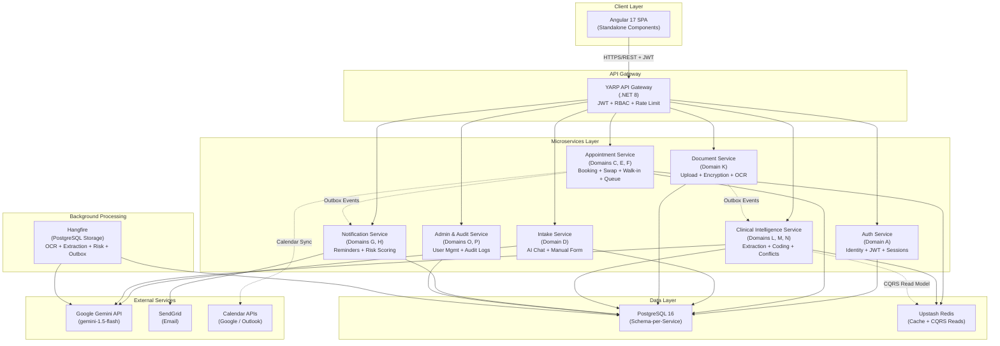
```mermaid
graph TB
    subgraph "Client Layer"
        FE["Angular 17 SPA<br/>(Standalone Components)"]
    end

    subgraph "API Gateway"
        GW["YARP API Gateway<br/>(.NET 8)<br/>JWT + RBAC + Rate Limit"]
    end

    subgraph "Microservices Layer"
        AUTH["Auth Service<br/>(Domain A)<br/>Identity + JWT + Sessions"]
        APPT["Appointment Service<br/>(Domains C, E, F)<br/>Booking + Swap + Walk-in + Queue"]
        INTAKE["Intake Service<br/>(Domain D)<br/>AI Chat + Manual Form"]
        DOC["Document Service<br/>(Domain K)<br/>Upload + Encryption + OCR"]
        CLINICAL["Clinical Intelligence Service<br/>(Domains L, M, N)<br/>Extraction + Coding + Conflicts"]
        NOTIF["Notification Service<br/>(Domains G, H)<br/>Reminders + Risk Scoring"]
        ADMIN["Admin & Audit Service<br/>(Domains O, P)<br/>User Mgmt + Audit Logs"]
    end

    subgraph "Data Layer"
        PG["PostgreSQL 16<br/>(Schema-per-Service)"]
        REDIS["Upstash Redis<br/>(Cache + CQRS Reads)"]
    end

    subgraph "External Services"
        GEMINI["Google Gemini API<br/>(gemini-1.5-flash)"]
        SENDGRID["SendGrid<br/>(Email)"]
        CALENDAR["Calendar APIs<br/>(Google / Outlook)"]
    end

    subgraph "Background Processing"
        HF["Hangfire<br/>(PostgreSQL Storage)<br/>OCR + Extraction + Risk + Outbox"]
    end

    FE -->|"HTTPS/REST + JWT"| GW
    GW --> AUTH
    GW --> APPT
    GW --> INTAKE
    GW --> DOC
    GW --> CLINICAL
    GW --> NOTIF
    GW --> ADMIN

    AUTH --> PG
    APPT --> PG
    APPT --> REDIS
    INTAKE --> PG
    INTAKE --> GEMINI
    DOC --> PG
    CLINICAL --> PG
    CLINICAL --> REDIS
    CLINICAL --> GEMINI
    NOTIF --> PG
    NOTIF --> SENDGRID
    ADMIN --> PG

    HF --> PG
    HF --> GEMINI

    APPT -.->|"Outbox Events"| NOTIF
    DOC -.->|"Outbox Events"| CLINICAL
    CLINICAL -.->|"CQRS Read Model"| REDIS
    APPT -.->|"Calendar Sync"| CALENDAR
```

---

### Deployment Architecture Diagram
<!-- RENDER type="plantuml" src="./uml-models/deployment-architecture.png" -->

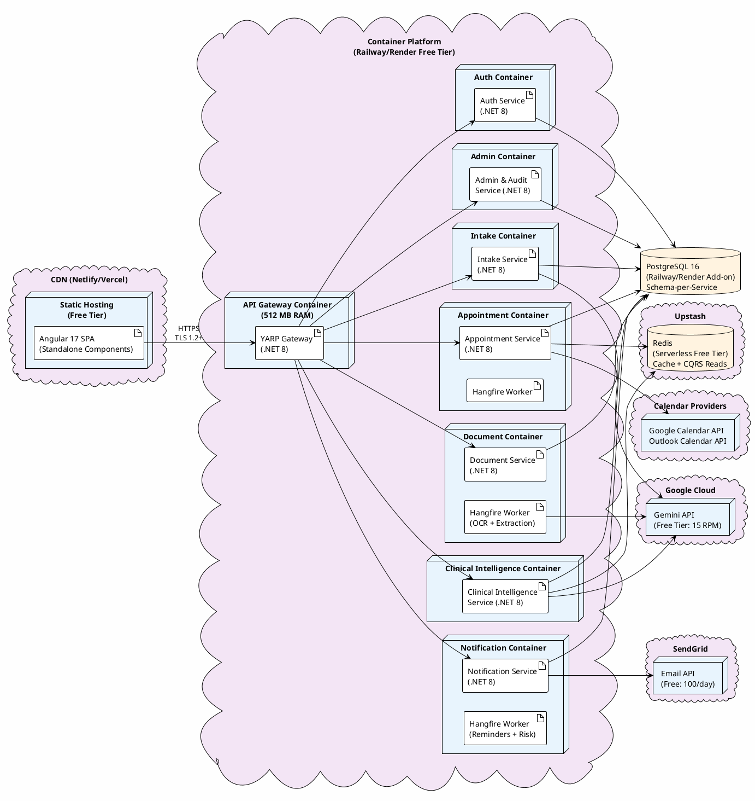
```plantuml
@startuml DM-002-deployment-architecture
!theme plain
left to right direction
skinparam backgroundColor #FEFEFE
skinparam nodeBackgroundColor #E8F4FD
skinparam databaseBackgroundColor #FFF3E0
skinparam cloudBackgroundColor #F3E5F5

cloud "CDN (Netlify/Vercel)" as CDN {
    node "Static Hosting\n(Free Tier)" as STATIC {
        artifact "Angular 17 SPA\n(Standalone Components)" as SPA
    }
}

cloud "Container Platform\n(Railway/Render Free Tier)" as CONTAINERS {
    node "API Gateway Container\n(512 MB RAM)" as GW_NODE {
        artifact "YARP Gateway\n(.NET 8)" as GW
    }
    node "Auth Container" as AUTH_NODE {
        artifact "Auth Service\n(.NET 8)" as AUTH
    }
    node "Appointment Container" as APPT_NODE {
        artifact "Appointment Service\n(.NET 8)" as APPT
        artifact "Hangfire Worker" as HF_APPT
    }
    node "Intake Container" as INTAKE_NODE {
        artifact "Intake Service\n(.NET 8)" as INTAKE
    }
    node "Document Container" as DOC_NODE {
        artifact "Document Service\n(.NET 8)" as DOC
        artifact "Hangfire Worker\n(OCR + Extraction)" as HF_DOC
    }
    node "Clinical Intelligence Container" as CLIN_NODE {
        artifact "Clinical Intelligence\nService (.NET 8)" as CLIN
    }
    node "Notification Container" as NOTIF_NODE {
        artifact "Notification Service\n(.NET 8)" as NOTIF
        artifact "Hangfire Worker\n(Reminders + Risk)" as HF_NOTIF
    }
    node "Admin Container" as ADMIN_NODE {
        artifact "Admin & Audit\nService (.NET 8)" as ADMIN
    }
}

database "PostgreSQL 16\n(Railway/Render Add-on)\nSchema-per-Service" as PG

cloud "Upstash" as UPSTASH {
    database "Redis\n(Serverless Free Tier)\nCache + CQRS Reads" as REDIS
}

cloud "Google Cloud" as GCLOUD {
    node "Gemini API\n(Free Tier: 15 RPM)" as GEMINI
}

cloud "SendGrid" as SG {
    node "Email API\n(Free: 100/day)" as EMAIL
}

cloud "Calendar Providers" as CALPROV {
    node "Google Calendar API\nOutlook Calendar API" as CALAPI
}

SPA -down-> GW : "HTTPS\nTLS 1.2+"
GW -down-> AUTH
GW -down-> APPT
GW -down-> INTAKE
GW -down-> DOC
GW -down-> CLIN
GW -down-> NOTIF
GW -down-> ADMIN

AUTH --> PG
APPT --> PG
INTAKE --> PG
DOC --> PG
CLIN --> PG
NOTIF --> PG
ADMIN --> PG

APPT --> REDIS
CLIN --> REDIS

INTAKE --> GEMINI
HF_DOC --> GEMINI
CLIN --> GEMINI

NOTIF --> EMAIL
APPT --> CALAPI
@enduml
```

---

### Data Flow Diagram
<!-- RENDER type="plantuml" src="./uml-models/data-flow.png" -->

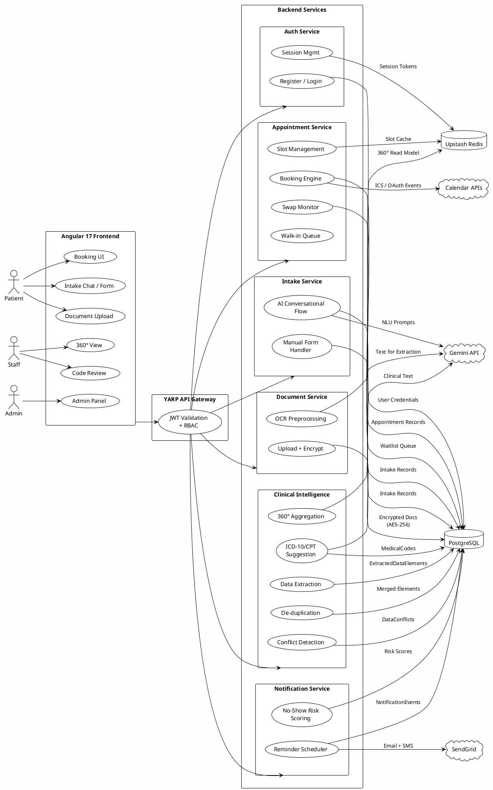
```plantuml
@startuml DM-003-data-flow
!theme plain
skinparam backgroundColor #FEFEFE

left to right direction

actor "Patient" as PAT
actor "Staff" as STAFF
actor "Admin" as ADM

rectangle "Angular 17 Frontend" as FE {
    (Booking UI) as BOOK_UI
    (Intake Chat / Form) as INTAKE_UI
    (Document Upload) as DOC_UI
    (360° View) as VIEW_UI
    (Code Review) as CODE_UI
    (Admin Panel) as ADMIN_UI
}

rectangle "YARP API Gateway" as GW {
    (JWT Validation\n+ RBAC) as AUTH_GW
}

rectangle "Backend Services" as BE {
    rectangle "Auth Service" as AUTH_SVC {
        (Register / Login) as AUTH_OP
        (Session Mgmt) as SESSION
    }
    rectangle "Appointment Service" as APPT_SVC {
        (Slot Management) as SLOT
        (Booking Engine) as BOOKING
        (Swap Monitor) as SWAP
        (Walk-in Queue) as WALKIN
    }
    rectangle "Intake Service" as INTAKE_SVC {
        (AI Conversational\nFlow) as AI_INTAKE
        (Manual Form\nHandler) as MANUAL_INTAKE
    }
    rectangle "Document Service" as DOC_SVC {
        (Upload + Encrypt) as UPLOAD
        (OCR Preprocessing) as OCR
    }
    rectangle "Clinical Intelligence" as CLIN_SVC {
        (Data Extraction) as EXTRACT
        (De-duplication) as DEDUP
        (Conflict Detection) as CONFLICT
        (ICD-10/CPT\nSuggestion) as CODING
        (360° Aggregation) as AGGREGATE
    }
    rectangle "Notification Service" as NOTIF_SVC {
        (Reminder Scheduler) as REMINDER
        (No-Show Risk\nScoring) as RISK
    }
}

database "PostgreSQL" as PG
database "Upstash Redis" as REDIS
cloud "Gemini API" as GEMINI
cloud "SendGrid" as SG
cloud "Calendar APIs" as CAL

PAT --> BOOK_UI
PAT --> INTAKE_UI
PAT --> DOC_UI
STAFF --> VIEW_UI
STAFF --> CODE_UI
ADM --> ADMIN_UI

FE --> AUTH_GW
AUTH_GW --> AUTH_SVC
AUTH_GW --> APPT_SVC
AUTH_GW --> INTAKE_SVC
AUTH_GW --> DOC_SVC
AUTH_GW --> CLIN_SVC
AUTH_GW --> NOTIF_SVC

AUTH_OP --> PG : "User Credentials"
SESSION --> REDIS : "Session Tokens"
BOOKING --> PG : "Appointment Records"
SLOT --> REDIS : "Slot Cache"
SWAP --> PG : "Waitlist Queue"
AI_INTAKE --> GEMINI : "NLU Prompts"
AI_INTAKE --> PG : "Intake Records"
MANUAL_INTAKE --> PG : "Intake Records"
UPLOAD --> PG : "Encrypted Docs\n(AES-256)"
OCR --> GEMINI : "Text for Extraction"
EXTRACT --> PG : "ExtractedDataElements"
DEDUP --> PG : "Merged Elements"
CONFLICT --> PG : "DataConflicts"
CODING --> GEMINI : "Clinical Text"
CODING --> PG : "MedicalCodes"
AGGREGATE --> REDIS : "360° Read Model"
REMINDER --> SG : "Email + SMS"
REMINDER --> PG : "NotificationEvents"
RISK --> PG : "Risk Scores"
BOOKING --> CAL : "ICS / OAuth Events"
@enduml
```

---

### Logical Data Model (ERD)
<!-- RENDER type="mermaid" src="./uml-models/logical-data-model.png" -->

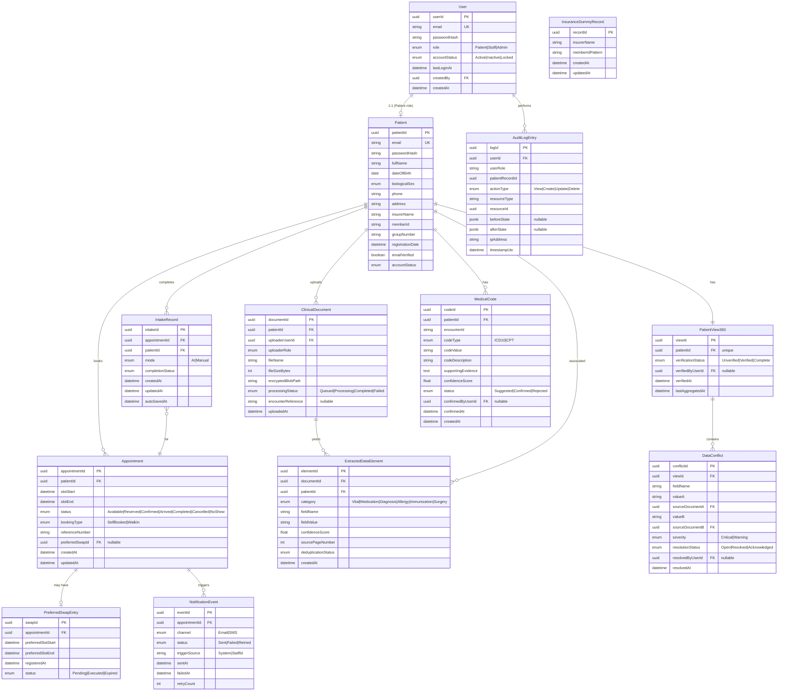
```mermaid
erDiagram
    User {
        uuid userId PK
        string email UK
        string passwordHash
        enum role "Patient|Staff|Admin"
        enum accountStatus "Active|Inactive|Locked"
        datetime lastLoginAt
        uuid createdBy FK
        datetime createdAt
    }

    Patient {
        uuid patientId PK
        string email UK
        string passwordHash
        string fullName
        date dateOfBirth
        enum biologicalSex
        string phone
        string address
        string insurerName
        string memberId
        string groupNumber
        datetime registrationDate
        boolean emailVerified
        enum accountStatus
    }

    Appointment {
        uuid appointmentId PK
        uuid patientId FK
        datetime slotStart
        datetime slotEnd
        enum status "Available|Reserved|Confirmed|Arrived|Completed|Cancelled|NoShow"
        enum bookingType "SelfBooked|WalkIn"
        string referenceNumber
        uuid preferredSwapId FK "nullable"
        datetime createdAt
        datetime updatedAt
    }

    PreferredSwapEntry {
        uuid swapId PK
        uuid appointmentId FK
        datetime preferredSlotStart
        datetime preferredSlotEnd
        datetime registeredAt
        enum status "Pending|Executed|Expired"
    }

    IntakeRecord {
        uuid intakeId PK
        uuid appointmentId FK
        uuid patientId FK
        enum mode "AI|Manual"
        enum completionStatus
        datetime createdAt
        datetime updatedAt
        datetime autoSavedAt
    }

    ClinicalDocument {
        uuid documentId PK
        uuid patientId FK
        uuid uploaderUserId FK
        enum uploaderRole
        string fileName
        int fileSizeBytes
        string encryptedBlobPath
        enum processingStatus "Queued|Processing|Completed|Failed"
        string encounterReference "nullable"
        datetime uploadedAt
    }

    ExtractedDataElement {
        uuid elementId PK
        uuid documentId FK
        uuid patientId FK
        enum category "Vital|Medication|Diagnosis|Allergy|Immunization|Surgery"
        string fieldName
        string fieldValue
        float confidenceScore
        int sourcePageNumber
        enum deduplicationStatus
        datetime createdAt
    }

    PatientView360 {
        uuid viewId PK
        uuid patientId FK "unique"
        enum verificationStatus "Unverified|Verified|Complete"
        uuid verifiedByUserId FK "nullable"
        datetime verifiedAt
        datetime lastAggregatedAt
    }

    DataConflict {
        uuid conflictId PK
        uuid viewId FK
        string fieldName
        string valueA
        uuid sourceDocumentA FK
        string valueB
        uuid sourceDocumentB FK
        enum severity "Critical|Warning"
        enum resolutionStatus "Open|Resolved|Acknowledged"
        uuid resolvedByUserId FK "nullable"
        datetime resolvedAt
    }

    MedicalCode {
        uuid codeId PK
        uuid patientId FK
        string encounterId
        enum codeType "ICD10|CPT"
        string codeValue
        string codeDescription
        text supportingEvidence
        float confidenceScore
        enum status "Suggested|Confirmed|Rejected"
        uuid confirmedByUserId FK "nullable"
        datetime confirmedAt
        datetime createdAt
    }

    AuditLogEntry {
        uuid logId PK
        uuid userId FK
        string userRole
        uuid patientRecordId
        enum actionType "View|Create|Update|Delete"
        string resourceType
        uuid resourceId
        jsonb beforeState "nullable"
        jsonb afterState "nullable"
        string ipAddress
        datetime timestampUtc
    }

    NotificationEvent {
        uuid eventId PK
        uuid appointmentId FK
        enum channel "Email|SMS"
        enum status "Sent|Failed|Retried"
        string triggerSource "System|StaffId"
        datetime sentAt
        datetime failedAt
        int retryCount
    }

    InsuranceDummyRecord {
        uuid recordId PK
        string insurerName
        string memberIdPattern
        datetime createdAt
        datetime updatedAt
    }

    User ||--o| Patient : "1:1 (Patient role)"
    User ||--o{ AuditLogEntry : "performs"
    Patient ||--o{ Appointment : "books"
    Patient ||--o{ ClinicalDocument : "uploads"
    Patient ||--|| PatientView360 : "has"
    Patient ||--o{ IntakeRecord : "completes"
    Appointment ||--o| PreferredSwapEntry : "may have"
    Appointment ||--o{ NotificationEvent : "triggers"
    IntakeRecord }o--|| Appointment : "for"
    ClinicalDocument ||--o{ ExtractedDataElement : "yields"
    PatientView360 ||--o{ DataConflict : "contains"
    Patient ||--o{ MedicalCode : "has"
    Patient ||--o{ ExtractedDataElement : "associated"
```

---

### AI Architecture Diagrams

#### AI Sequence Diagram — UC-002: AI-Assisted Conversational Intake
<!-- RENDER type="mermaid" src="./uml-models/ai-seq-uc-002.png" -->

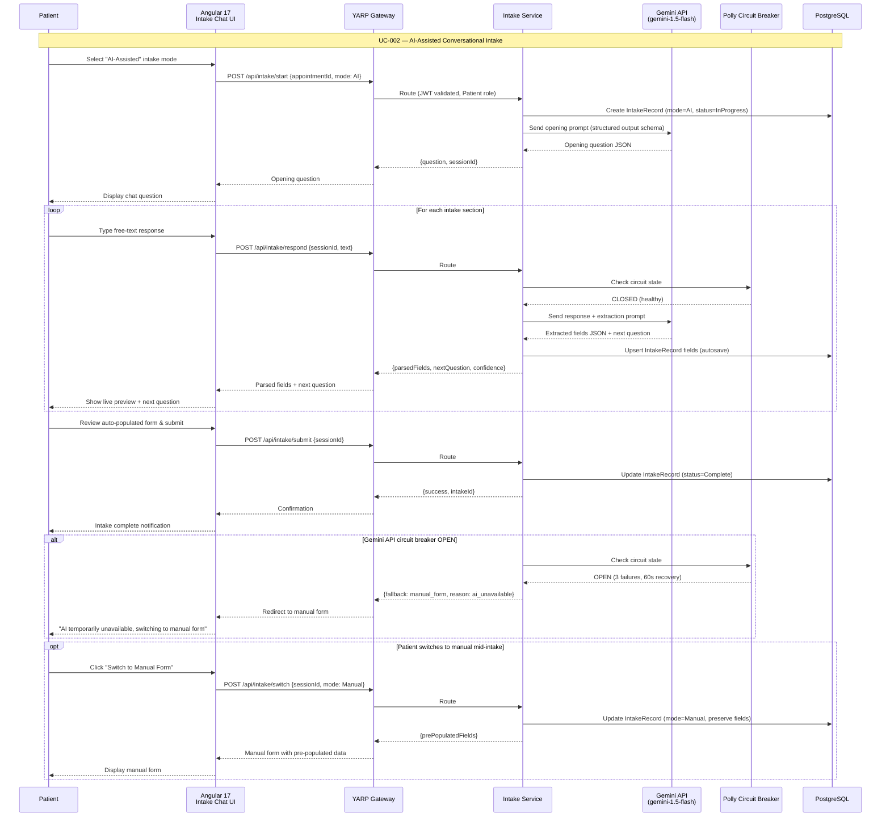
```mermaid
sequenceDiagram
    participant P as Patient
    participant UI as Angular 17<br/>Intake Chat UI
    participant GW as YARP Gateway
    participant IS as Intake Service
    participant GEMINI as Gemini API<br/>(gemini-1.5-flash)
    participant CB as Polly Circuit Breaker
    participant DB as PostgreSQL

    Note over P,DB: UC-002 — AI-Assisted Conversational Intake

    P->>UI: Select "AI-Assisted" intake mode
    UI->>GW: POST /api/intake/start {appointmentId, mode: AI}
    GW->>IS: Route (JWT validated, Patient role)
    IS->>DB: Create IntakeRecord (mode=AI, status=InProgress)
    IS->>GEMINI: Send opening prompt (structured output schema)
    GEMINI-->>IS: Opening question JSON
    IS-->>GW: {question, sessionId}
    GW-->>UI: Opening question
    UI-->>P: Display chat question

    loop For each intake section
        P->>UI: Type free-text response
        UI->>GW: POST /api/intake/respond {sessionId, text}
        GW->>IS: Route
        IS->>CB: Check circuit state
        CB-->>IS: CLOSED (healthy)
        IS->>GEMINI: Send response + extraction prompt
        GEMINI-->>IS: Extracted fields JSON + next question
        IS->>DB: Upsert IntakeRecord fields (autosave)
        IS-->>GW: {parsedFields, nextQuestion, confidence}
        GW-->>UI: Parsed fields + next question
        UI-->>P: Show live preview + next question
    end

    P->>UI: Review auto-populated form & submit
    UI->>GW: POST /api/intake/submit {sessionId}
    GW->>IS: Route
    IS->>DB: Update IntakeRecord (status=Complete)
    IS-->>GW: {success, intakeId}
    GW-->>UI: Confirmation
    UI-->>P: Intake complete notification

    alt Gemini API circuit breaker OPEN
        IS->>CB: Check circuit state
        CB-->>IS: OPEN (3 failures, 60s recovery)
        IS-->>GW: {fallback: manual_form, reason: ai_unavailable}
        GW-->>UI: Redirect to manual form
        UI-->>P: "AI temporarily unavailable, switching to manual form"
    end

    opt Patient switches to manual mid-intake
        P->>UI: Click "Switch to Manual Form"
        UI->>GW: POST /api/intake/switch {sessionId, mode: Manual}
        GW->>IS: Route
        IS->>DB: Update IntakeRecord (mode=Manual, preserve fields)
        IS-->>GW: {prePopulatedFields}
        GW-->>UI: Manual form with pre-populated data
        UI-->>P: Display manual form
    end
```

---

#### AI Sequence Diagram — UC-008: 360-Degree Patient View Generation
<!-- RENDER type="mermaid" src="./uml-models/ai-seq-uc-008.png" -->

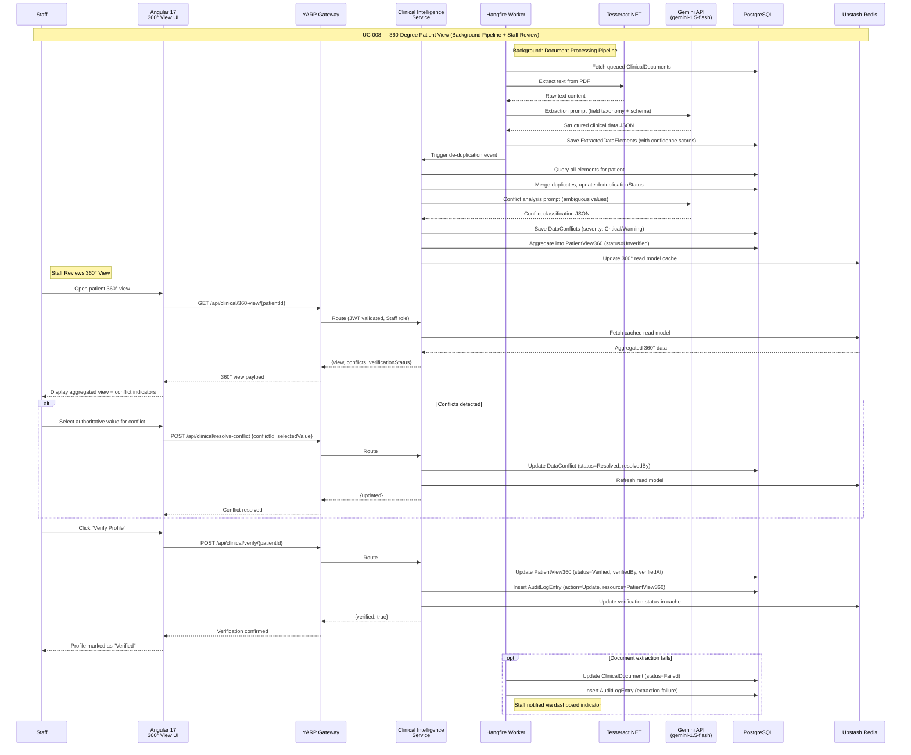
```mermaid
sequenceDiagram
    participant S as Staff
    participant UI as Angular 17<br/>360° View UI
    participant GW as YARP Gateway
    participant CS as Clinical Intelligence<br/>Service
    participant HF as Hangfire Worker
    participant OCR as Tesseract.NET
    participant GEMINI as Gemini API<br/>(gemini-1.5-flash)
    participant DB as PostgreSQL
    participant REDIS as Upstash Redis

    Note over S,REDIS: UC-008 — 360-Degree Patient View (Background Pipeline + Staff Review)

    Note right of HF: Background: Document Processing Pipeline
    HF->>DB: Fetch queued ClinicalDocuments
    HF->>OCR: Extract text from PDF
    OCR-->>HF: Raw text content
    HF->>GEMINI: Extraction prompt (field taxonomy + schema)
    GEMINI-->>HF: Structured clinical data JSON
    HF->>DB: Save ExtractedDataElements (with confidence scores)
    HF->>CS: Trigger de-duplication event
    CS->>DB: Query all elements for patient
    CS->>DB: Merge duplicates, update deduplicationStatus
    CS->>GEMINI: Conflict analysis prompt (ambiguous values)
    GEMINI-->>CS: Conflict classification JSON
    CS->>DB: Save DataConflicts (severity: Critical/Warning)
    CS->>DB: Aggregate into PatientView360 (status=Unverified)
    CS->>REDIS: Update 360° read model cache

    Note right of S: Staff Reviews 360° View
    S->>UI: Open patient 360° view
    UI->>GW: GET /api/clinical/360-view/{patientId}
    GW->>CS: Route (JWT validated, Staff role)
    CS->>REDIS: Fetch cached read model
    REDIS-->>CS: Aggregated 360° data
    CS-->>GW: {view, conflicts, verificationStatus}
    GW-->>UI: 360° view payload
    UI-->>S: Display aggregated view + conflict indicators

    alt Conflicts detected
        S->>UI: Select authoritative value for conflict
        UI->>GW: POST /api/clinical/resolve-conflict {conflictId, selectedValue}
        GW->>CS: Route
        CS->>DB: Update DataConflict (status=Resolved, resolvedBy)
        CS->>REDIS: Refresh read model
        CS-->>GW: {updated}
        GW-->>UI: Conflict resolved
    end

    S->>UI: Click "Verify Profile"
    UI->>GW: POST /api/clinical/verify/{patientId}
    GW->>CS: Route
    CS->>DB: Update PatientView360 (status=Verified, verifiedBy, verifiedAt)
    CS->>DB: Insert AuditLogEntry (action=Update, resource=PatientView360)
    CS->>REDIS: Update verification status in cache
    CS-->>GW: {verified: true}
    GW-->>UI: Verification confirmed
    UI-->>S: Profile marked as "Verified"

    opt Document extraction fails
        HF->>DB: Update ClinicalDocument (status=Failed)
        HF->>DB: Insert AuditLogEntry (extraction failure)
        Note right of HF: Staff notified via dashboard indicator
    end
```

---

#### AI Sequence Diagram — UC-009: Medical Code Suggestion & Confirmation
<!-- RENDER type="mermaid" src="./uml-models/ai-seq-uc-009.png" -->

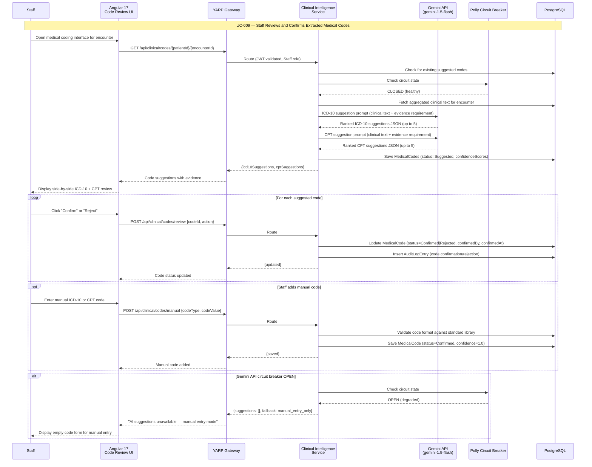
```mermaid
sequenceDiagram
    participant S as Staff
    participant UI as Angular 17<br/>Code Review UI
    participant GW as YARP Gateway
    participant CS as Clinical Intelligence<br/>Service
    participant GEMINI as Gemini API<br/>(gemini-1.5-flash)
    participant CB as Polly Circuit Breaker
    participant DB as PostgreSQL

    Note over S,DB: UC-009 — Staff Reviews and Confirms Extracted Medical Codes

    S->>UI: Open medical coding interface for encounter
    UI->>GW: GET /api/clinical/codes/{patientId}/{encounterId}
    GW->>CS: Route (JWT validated, Staff role)
    CS->>DB: Check for existing suggested codes
    CS->>CB: Check circuit state
    CB-->>CS: CLOSED (healthy)
    CS->>DB: Fetch aggregated clinical text for encounter
    CS->>GEMINI: ICD-10 suggestion prompt (clinical text + evidence requirement)
    GEMINI-->>CS: Ranked ICD-10 suggestions JSON (up to 5)
    CS->>GEMINI: CPT suggestion prompt (clinical text + evidence requirement)
    GEMINI-->>CS: Ranked CPT suggestions JSON (up to 5)
    CS->>DB: Save MedicalCodes (status=Suggested, confidenceScores)
    CS-->>GW: {icd10Suggestions, cptSuggestions}
    GW-->>UI: Code suggestions with evidence
    UI-->>S: Display side-by-side ICD-10 + CPT review

    loop For each suggested code
        S->>UI: Click "Confirm" or "Reject"
        UI->>GW: POST /api/clinical/codes/review {codeId, action}
        GW->>CS: Route
        CS->>DB: Update MedicalCode (status=Confirmed|Rejected, confirmedBy, confirmedAt)
        CS->>DB: Insert AuditLogEntry (code confirmation/rejection)
        CS-->>GW: {updated}
        GW-->>UI: Code status updated
    end

    opt Staff adds manual code
        S->>UI: Enter manual ICD-10 or CPT code
        UI->>GW: POST /api/clinical/codes/manual {codeType, codeValue}
        GW->>CS: Route
        CS->>DB: Validate code format against standard library
        CS->>DB: Save MedicalCode (status=Confirmed, confidence=1.0)
        CS-->>GW: {saved}
        GW-->>UI: Manual code added
    end

    alt Gemini API circuit breaker OPEN
        CS->>CB: Check circuit state
        CB-->>CS: OPEN (degraded)
        CS-->>GW: {suggestions: [], fallback: manual_entry_only}
        GW-->>UI: "AI suggestions unavailable — manual entry mode"
        UI-->>S: Display empty code form for manual entry
    end
```

---

## Use Case Sequence Diagrams

### UC-001: Patient Self-Registers and Books an Appointment
**Source:** `spec.md#UC-001`

<!-- RENDER type="mermaid" src="./uml-models/seq-uc-001.png" -->

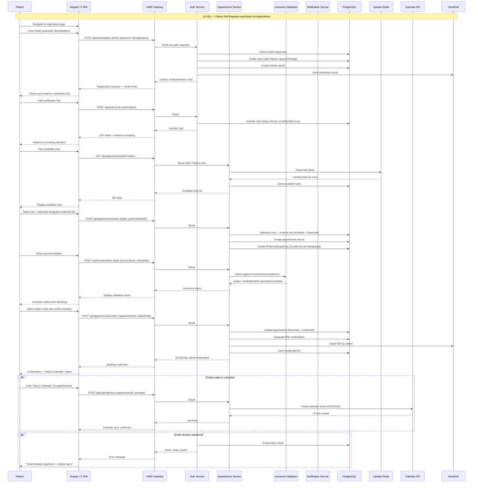
```mermaid
sequenceDiagram
    participant P as Patient
    participant UI as Angular 17 SPA
    participant GW as YARP Gateway
    participant AUTH as Auth Service
    participant APPT as Appointment Service
    participant INS as Insurance Validation
    participant NOTIF as Notification Service
    participant DB as PostgreSQL
    participant REDIS as Upstash Redis
    participant CAL as Calendar API
    participant SG as SendGrid

    Note over P,SG: UC-001 — Patient Self-Registers and Books an Appointment

    P->>UI: Navigate to registration page
    P->>UI: Enter email, password, demographics
    UI->>GW: POST /api/auth/register {email, password, demographics}
    GW->>AUTH: Route (no auth required)
    AUTH->>DB: Check email uniqueness
    AUTH->>DB: Create User (role=Patient, status=Pending)
    AUTH->>DB: Create Patient record
    AUTH->>SG: Send verification email
    AUTH-->>GW: {userId, verificationSent: true}
    GW-->>UI: Registration success — verify email
    UI-->>P: "Check your email for verification link"

    P->>UI: Click verification link
    UI->>GW: POST /api/auth/verify-email {token}
    GW->>AUTH: Route
    AUTH->>DB: Activate User (status=Active, emailVerified=true)
    AUTH-->>GW: {verified, jwt}
    GW-->>UI: JWT token + redirect to booking
    UI-->>P: Redirect to booking interface

    P->>UI: View available slots
    UI->>GW: GET /api/appointments/slots?date=...
    GW->>APPT: Route (JWT, Patient role)
    APPT->>REDIS: Check slot cache
    REDIS-->>APPT: Cached slots (or miss)
    APPT->>DB: Query available slots
    APPT-->>GW: Available slots list
    GW-->>UI: Slot data
    UI-->>P: Display available slots

    P->>UI: Select slot + optionally designate preferred slot
    UI->>GW: POST /api/appointments/book {slotId, preferredSlotId?}
    GW->>APPT: Route
    APPT->>DB: Optimistic lock — reserve slot (Available→Reserved)
    APPT->>DB: Create Appointment record
    APPT->>DB: Create PreferredSwapEntry (if preferred slot designated)

    P->>UI: Enter insurance details
    UI->>GW: POST /api/insurance/pre-check {insurerName, memberId}
    GW->>APPT: Route
    APPT->>INS: Match against InsuranceDummyRecord
    INS-->>APPT: {status: Verified|NotRecognized|Incomplete}
    APPT-->>GW: Insurance status
    GW-->>UI: Display validation result
    UI-->>P: Insurance status (non-blocking)

    P->>UI: Select intake mode and confirm booking
    UI->>GW: POST /api/appointments/confirm {appointmentId, intakeMode}
    GW->>APPT: Route
    APPT->>DB: Update Appointment (Reserved→Confirmed)
    APPT->>DB: Generate PDF confirmation
    APPT->>SG: Email PDF to patient
    APPT->>DB: Insert AuditLogEntry
    APPT-->>GW: {confirmed, referenceNumber}
    GW-->>UI: Booking confirmed
    UI-->>P: Confirmation + "Add to Calendar" option

    alt Patient adds to calendar
        P->>UI: Click "Add to Calendar" (Google/Outlook)
        UI->>GW: POST /api/calendar/sync {appointmentId, provider}
        GW->>APPT: Route
        APPT->>CAL: Create calendar event (ICS/OAuth)
        CAL-->>APPT: Event created
        APPT-->>GW: {synced}
        GW-->>UI: Calendar sync confirmed
    end

    alt Email already registered
        AUTH->>DB: Email exists check
        AUTH-->>GW: {error: email_exists}
        GW-->>UI: Error message
        UI-->>P: "Email already registered — please log in"
    end
```

---

### UC-002: Patient Completes AI-Assisted Conversational Intake
**Source:** `spec.md#UC-002`

<!-- RENDER type="mermaid" src="./uml-models/seq-uc-002.png" -->

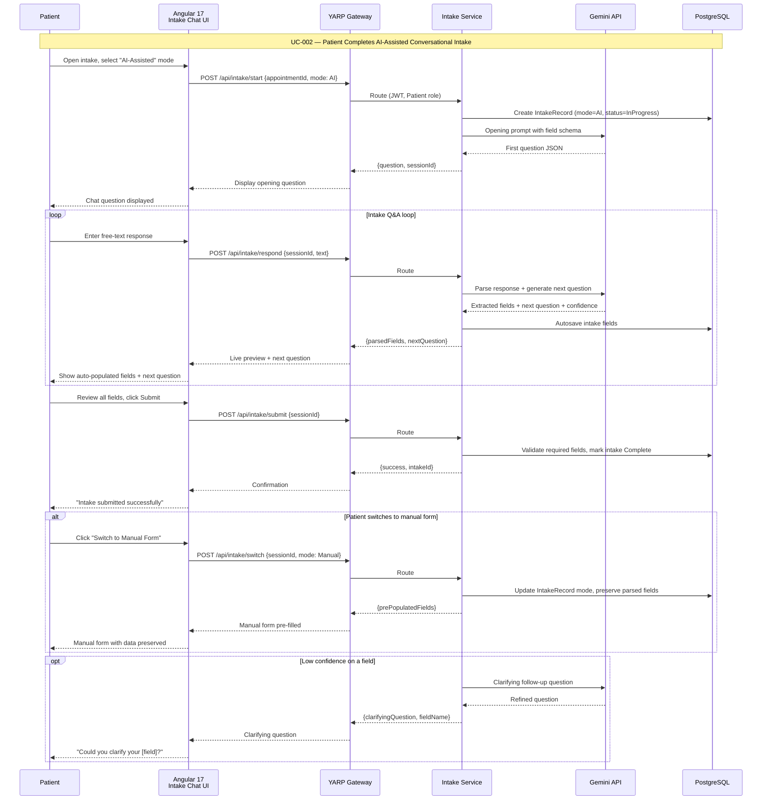
```mermaid
sequenceDiagram
    participant P as Patient
    participant UI as Angular 17<br/>Intake Chat UI
    participant GW as YARP Gateway
    participant IS as Intake Service
    participant GEMINI as Gemini API
    participant DB as PostgreSQL

    Note over P,DB: UC-002 — Patient Completes AI-Assisted Conversational Intake

    P->>UI: Open intake, select "AI-Assisted" mode
    UI->>GW: POST /api/intake/start {appointmentId, mode: AI}
    GW->>IS: Route (JWT, Patient role)
    IS->>DB: Create IntakeRecord (mode=AI, status=InProgress)
    IS->>GEMINI: Opening prompt with field schema
    GEMINI-->>IS: First question JSON
    IS-->>GW: {question, sessionId}
    GW-->>UI: Display opening question
    UI-->>P: Chat question displayed

    loop Intake Q&A loop
        P->>UI: Enter free-text response
        UI->>GW: POST /api/intake/respond {sessionId, text}
        GW->>IS: Route
        IS->>GEMINI: Parse response + generate next question
        GEMINI-->>IS: Extracted fields + next question + confidence
        IS->>DB: Autosave intake fields
        IS-->>GW: {parsedFields, nextQuestion}
        GW-->>UI: Live preview + next question
        UI-->>P: Show auto-populated fields + next question
    end

    P->>UI: Review all fields, click Submit
    UI->>GW: POST /api/intake/submit {sessionId}
    GW->>IS: Route
    IS->>DB: Validate required fields, mark intake Complete
    IS-->>GW: {success, intakeId}
    GW-->>UI: Confirmation
    UI-->>P: "Intake submitted successfully"

    alt Patient switches to manual form
        P->>UI: Click "Switch to Manual Form"
        UI->>GW: POST /api/intake/switch {sessionId, mode: Manual}
        GW->>IS: Route
        IS->>DB: Update IntakeRecord mode, preserve parsed fields
        IS-->>GW: {prePopulatedFields}
        GW-->>UI: Manual form pre-filled
        UI-->>P: Manual form with data preserved
    end

    opt Low confidence on a field
        IS->>GEMINI: Clarifying follow-up question
        GEMINI-->>IS: Refined question
        IS-->>GW: {clarifyingQuestion, fieldName}
        GW-->>UI: Clarifying question
        UI-->>P: "Could you clarify your [field]?"
    end
```

---

### UC-003: Patient Completes Manual Intake Form
**Source:** `spec.md#UC-003`

<!-- RENDER type="mermaid" src="./uml-models/seq-uc-003.png" -->

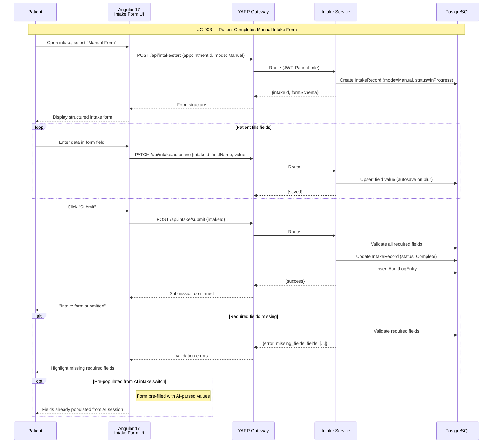
```mermaid
sequenceDiagram
    participant P as Patient
    participant UI as Angular 17<br/>Intake Form UI
    participant GW as YARP Gateway
    participant IS as Intake Service
    participant DB as PostgreSQL

    Note over P,DB: UC-003 — Patient Completes Manual Intake Form

    P->>UI: Open intake, select "Manual Form"
    UI->>GW: POST /api/intake/start {appointmentId, mode: Manual}
    GW->>IS: Route (JWT, Patient role)
    IS->>DB: Create IntakeRecord (mode=Manual, status=InProgress)
    IS-->>GW: {intakeId, formSchema}
    GW-->>UI: Form structure
    UI-->>P: Display structured intake form

    loop Patient fills fields
        P->>UI: Enter data in form field
        UI->>GW: PATCH /api/intake/autosave {intakeId, fieldName, value}
        GW->>IS: Route
        IS->>DB: Upsert field value (autosave on blur)
        IS-->>GW: {saved}
    end

    P->>UI: Click "Submit"
    UI->>GW: POST /api/intake/submit {intakeId}
    GW->>IS: Route
    IS->>DB: Validate all required fields
    IS->>DB: Update IntakeRecord (status=Complete)
    IS->>DB: Insert AuditLogEntry
    IS-->>GW: {success}
    GW-->>UI: Submission confirmed
    UI-->>P: "Intake form submitted"

    alt Required fields missing
        IS->>DB: Validate required fields
        IS-->>GW: {error: missing_fields, fields: [...]}
        GW-->>UI: Validation errors
        UI-->>P: Highlight missing required fields
    end

    opt Pre-populated from AI intake switch
        Note right of UI: Form pre-filled with AI-parsed values
        UI-->>P: Fields already populated from AI session
    end
```

---

### UC-004: Preferred Slot Swap Triggered Automatically
**Source:** `spec.md#UC-004`

<!-- RENDER type="mermaid" src="./uml-models/seq-uc-004.png" -->

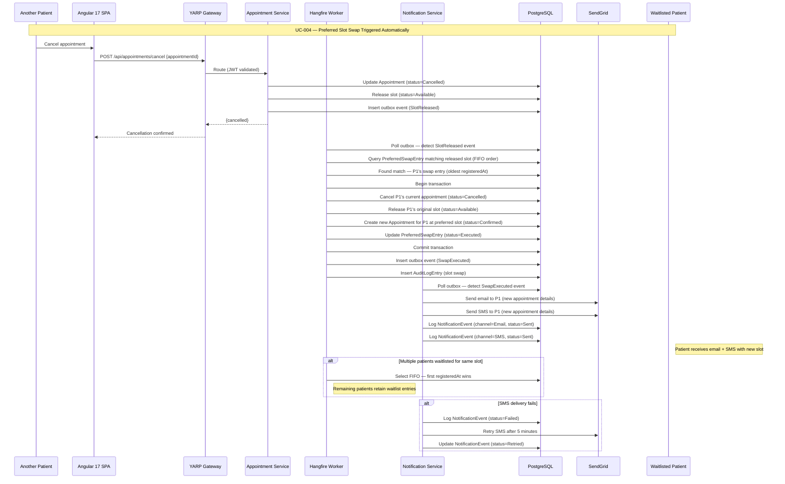
```mermaid
sequenceDiagram
    participant P2 as Another Patient
    participant UI2 as Angular 17 SPA
    participant GW as YARP Gateway
    participant APPT as Appointment Service
    participant HF as Hangfire Worker
    participant NOTIF as Notification Service
    participant DB as PostgreSQL
    participant SG as SendGrid
    participant P1 as Waitlisted Patient

    Note over P2,P1: UC-004 — Preferred Slot Swap Triggered Automatically

    P2->>UI2: Cancel appointment
    UI2->>GW: POST /api/appointments/cancel {appointmentId}
    GW->>APPT: Route (JWT validated)
    APPT->>DB: Update Appointment (status=Cancelled)
    APPT->>DB: Release slot (status=Available)
    APPT->>DB: Insert outbox event (SlotReleased)
    APPT-->>GW: {cancelled}
    GW-->>UI2: Cancellation confirmed

    HF->>DB: Poll outbox — detect SlotReleased event
    HF->>DB: Query PreferredSwapEntry matching released slot (FIFO order)
    HF->>DB: Found match — P1's swap entry (oldest registeredAt)

    HF->>DB: Begin transaction
    HF->>DB: Cancel P1's current appointment (status=Cancelled)
    HF->>DB: Release P1's original slot (status=Available)
    HF->>DB: Create new Appointment for P1 at preferred slot (status=Confirmed)
    HF->>DB: Update PreferredSwapEntry (status=Executed)
    HF->>DB: Commit transaction

    HF->>DB: Insert outbox event (SwapExecuted)
    HF->>DB: Insert AuditLogEntry (slot swap)

    NOTIF->>DB: Poll outbox — detect SwapExecuted event
    NOTIF->>SG: Send email to P1 (new appointment details)
    NOTIF->>SG: Send SMS to P1 (new appointment details)
    NOTIF->>DB: Log NotificationEvent (channel=Email, status=Sent)
    NOTIF->>DB: Log NotificationEvent (channel=SMS, status=Sent)

    Note right of P1: Patient receives email + SMS with new slot

    alt Multiple patients waitlisted for same slot
        HF->>DB: Select FIFO — first registeredAt wins
        Note right of HF: Remaining patients retain waitlist entries
    end

    alt SMS delivery fails
        NOTIF->>DB: Log NotificationEvent (status=Failed)
        NOTIF->>SG: Retry SMS after 5 minutes
        NOTIF->>DB: Update NotificationEvent (status=Retried)
    end
```

---

### UC-005: Staff Creates a Walk-In Booking
**Source:** `spec.md#UC-005`

<!-- RENDER type="mermaid" src="./uml-models/seq-uc-005.png" -->

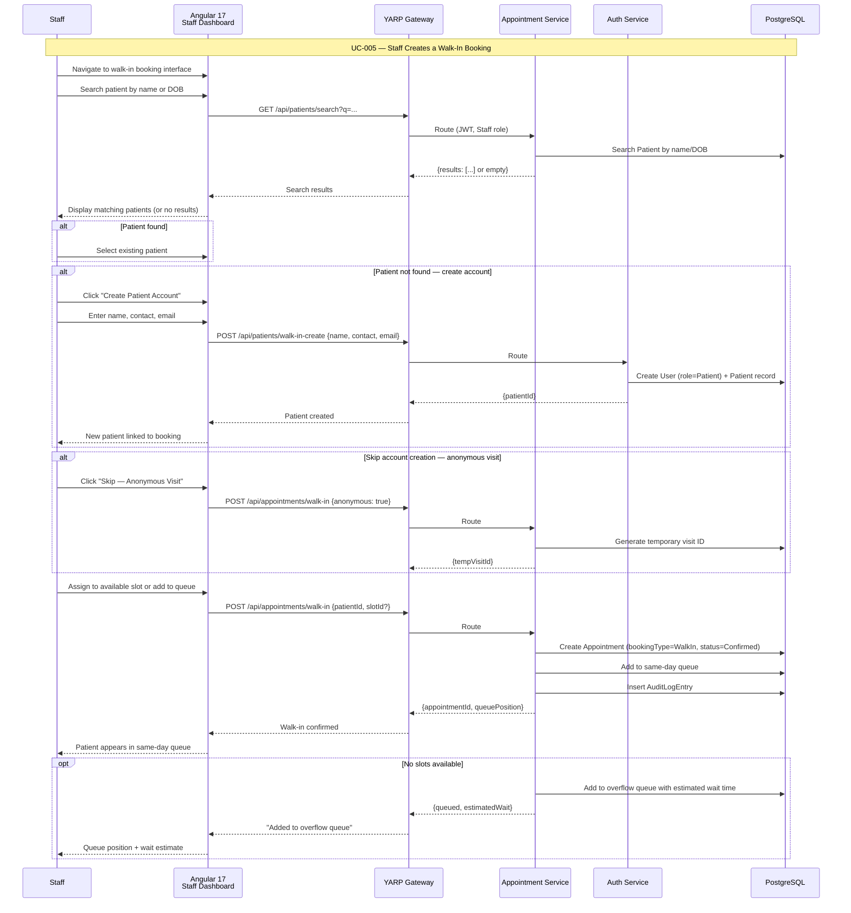
```mermaid
sequenceDiagram
    participant S as Staff
    participant UI as Angular 17<br/>Staff Dashboard
    participant GW as YARP Gateway
    participant APPT as Appointment Service
    participant AUTH as Auth Service
    participant DB as PostgreSQL

    Note over S,DB: UC-005 — Staff Creates a Walk-In Booking

    S->>UI: Navigate to walk-in booking interface
    S->>UI: Search patient by name or DOB
    UI->>GW: GET /api/patients/search?q=...
    GW->>APPT: Route (JWT, Staff role)
    APPT->>DB: Search Patient by name/DOB
    APPT-->>GW: {results: [...] or empty}
    GW-->>UI: Search results
    UI-->>S: Display matching patients (or no results)

    alt Patient found
        S->>UI: Select existing patient
    end

    alt Patient not found — create account
        S->>UI: Click "Create Patient Account"
        S->>UI: Enter name, contact, email
        UI->>GW: POST /api/patients/walk-in-create {name, contact, email}
        GW->>AUTH: Route
        AUTH->>DB: Create User (role=Patient) + Patient record
        AUTH-->>GW: {patientId}
        GW-->>UI: Patient created
        UI-->>S: New patient linked to booking
    end

    alt Skip account creation — anonymous visit
        S->>UI: Click "Skip — Anonymous Visit"
        UI->>GW: POST /api/appointments/walk-in {anonymous: true}
        GW->>APPT: Route
        APPT->>DB: Generate temporary visit ID
        APPT-->>GW: {tempVisitId}
    end

    S->>UI: Assign to available slot or add to queue
    UI->>GW: POST /api/appointments/walk-in {patientId, slotId?}
    GW->>APPT: Route
    APPT->>DB: Create Appointment (bookingType=WalkIn, status=Confirmed)
    APPT->>DB: Add to same-day queue
    APPT->>DB: Insert AuditLogEntry
    APPT-->>GW: {appointmentId, queuePosition}
    GW-->>UI: Walk-in confirmed
    UI-->>S: Patient appears in same-day queue

    opt No slots available
        APPT->>DB: Add to overflow queue with estimated wait time
        APPT-->>GW: {queued, estimatedWait}
        GW-->>UI: "Added to overflow queue"
        UI-->>S: Queue position + wait estimate
    end
```

---

### UC-006: Staff Marks Patient as Arrived
**Source:** `spec.md#UC-006`

<!-- RENDER type="mermaid" src="./uml-models/seq-uc-006.png" -->

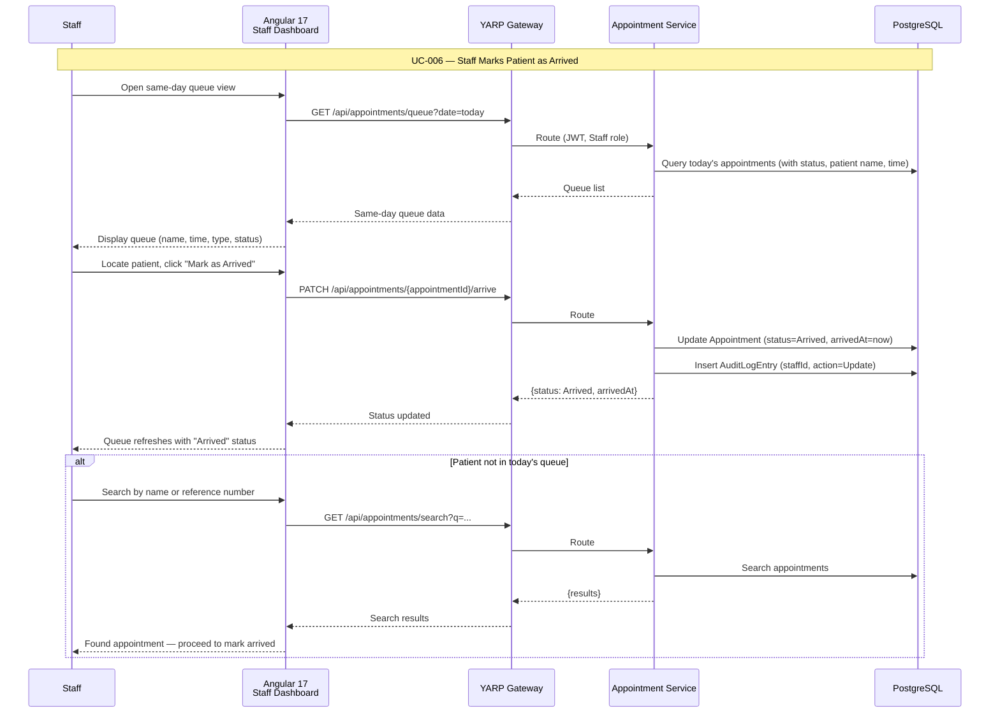
```mermaid
sequenceDiagram
    participant S as Staff
    participant UI as Angular 17<br/>Staff Dashboard
    participant GW as YARP Gateway
    participant APPT as Appointment Service
    participant DB as PostgreSQL

    Note over S,DB: UC-006 — Staff Marks Patient as Arrived

    S->>UI: Open same-day queue view
    UI->>GW: GET /api/appointments/queue?date=today
    GW->>APPT: Route (JWT, Staff role)
    APPT->>DB: Query today's appointments (with status, patient name, time)
    APPT-->>GW: Queue list
    GW-->>UI: Same-day queue data
    UI-->>S: Display queue (name, time, type, status)

    S->>UI: Locate patient, click "Mark as Arrived"
    UI->>GW: PATCH /api/appointments/{appointmentId}/arrive
    GW->>APPT: Route
    APPT->>DB: Update Appointment (status=Arrived, arrivedAt=now)
    APPT->>DB: Insert AuditLogEntry (staffId, action=Update)
    APPT-->>GW: {status: Arrived, arrivedAt}
    GW-->>UI: Status updated
    UI-->>S: Queue refreshes with "Arrived" status

    alt Patient not in today's queue
        S->>UI: Search by name or reference number
        UI->>GW: GET /api/appointments/search?q=...
        GW->>APPT: Route
        APPT->>DB: Search appointments
        APPT-->>GW: {results}
        GW-->>UI: Search results
        UI-->>S: Found appointment — proceed to mark arrived
    end
```

---

### UC-007: Patient Uploads Clinical Documents
**Source:** `spec.md#UC-007`

<!-- RENDER type="mermaid" src="./uml-models/seq-uc-007.png" -->

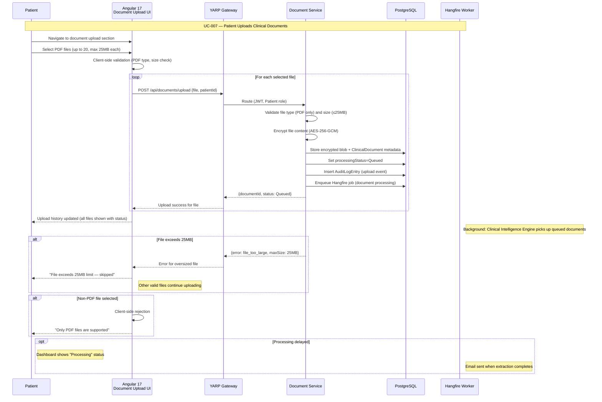
```mermaid
sequenceDiagram
    participant P as Patient
    participant UI as Angular 17<br/>Document Upload UI
    participant GW as YARP Gateway
    participant DOC as Document Service
    participant DB as PostgreSQL
    participant HF as Hangfire Worker

    Note over P,HF: UC-007 — Patient Uploads Clinical Documents

    P->>UI: Navigate to document upload section
    P->>UI: Select PDF files (up to 20, max 25MB each)
    UI->>UI: Client-side validation (PDF type, size check)

    loop For each selected file
        UI->>GW: POST /api/documents/upload {file, patientId}
        GW->>DOC: Route (JWT, Patient role)
        DOC->>DOC: Validate file type (PDF only) and size (≤25MB)
        DOC->>DOC: Encrypt file content (AES-256-GCM)
        DOC->>DB: Store encrypted blob + ClinicalDocument metadata
        DOC->>DB: Set processingStatus=Queued
        DOC->>DB: Insert AuditLogEntry (upload event)
        DOC->>DB: Enqueue Hangfire job (document processing)
        DOC-->>GW: {documentId, status: Queued}
        GW-->>UI: Upload success for file
    end

    UI-->>P: Upload history updated (all files shown with status)

    Note right of HF: Background: Clinical Intelligence Engine picks up queued documents

    alt File exceeds 25MB
        DOC-->>GW: {error: file_too_large, maxSize: 25MB}
        GW-->>UI: Error for oversized file
        UI-->>P: "File exceeds 25MB limit — skipped"
        Note right of UI: Other valid files continue uploading
    end

    alt Non-PDF file selected
        UI->>UI: Client-side rejection
        UI-->>P: "Only PDF files are supported"
    end

    opt Processing delayed
        Note right of P: Dashboard shows "Processing" status
        Note right of HF: Email sent when extraction completes
    end
```

---

### UC-008: System Generates 360-Degree Patient View
**Source:** `spec.md#UC-008`

<!-- RENDER type="mermaid" src="./uml-models/seq-uc-008.png" -->

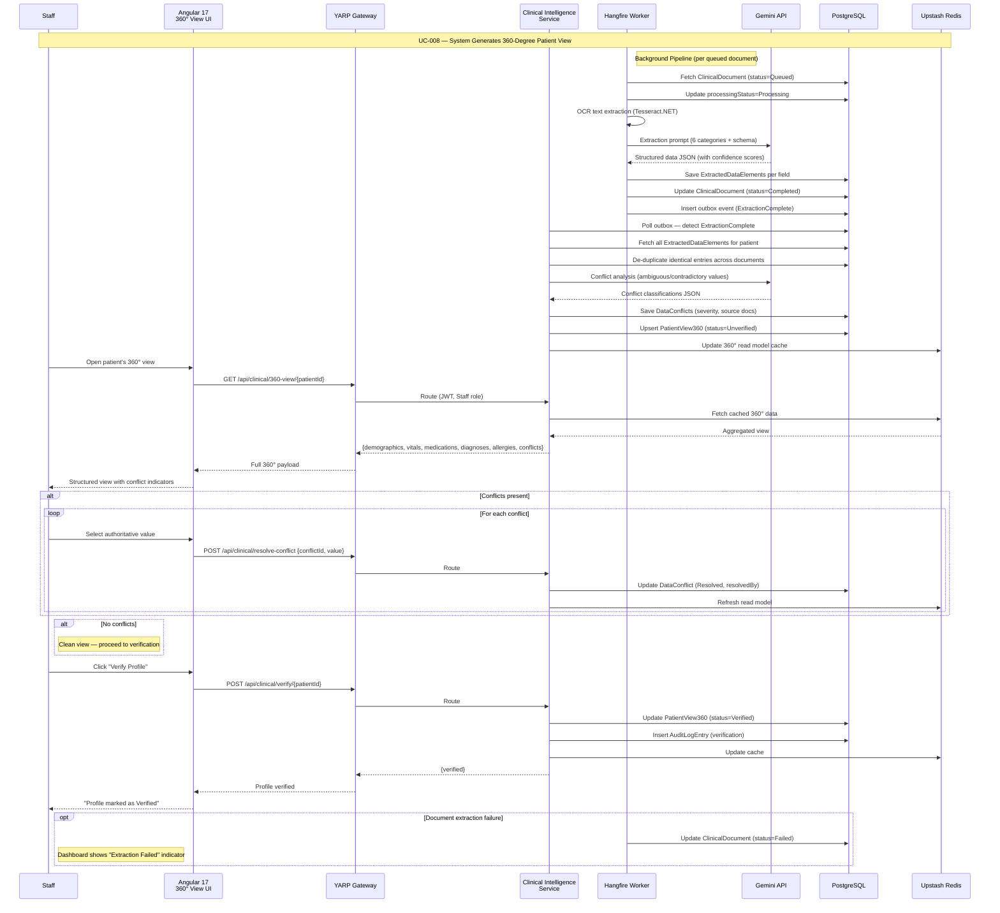
```mermaid
sequenceDiagram
    participant S as Staff
    participant UI as Angular 17<br/>360° View UI
    participant GW as YARP Gateway
    participant CS as Clinical Intelligence<br/>Service
    participant HF as Hangfire Worker
    participant GEMINI as Gemini API
    participant DB as PostgreSQL
    participant REDIS as Upstash Redis

    Note over S,REDIS: UC-008 — System Generates 360-Degree Patient View

    Note right of HF: Background Pipeline (per queued document)
    HF->>DB: Fetch ClinicalDocument (status=Queued)
    HF->>DB: Update processingStatus=Processing
    HF->>HF: OCR text extraction (Tesseract.NET)
    HF->>GEMINI: Extraction prompt (6 categories + schema)
    GEMINI-->>HF: Structured data JSON (with confidence scores)
    HF->>DB: Save ExtractedDataElements per field
    HF->>DB: Update ClinicalDocument (status=Completed)
    HF->>DB: Insert outbox event (ExtractionComplete)

    CS->>DB: Poll outbox — detect ExtractionComplete
    CS->>DB: Fetch all ExtractedDataElements for patient
    CS->>DB: De-duplicate identical entries across documents
    CS->>GEMINI: Conflict analysis (ambiguous/contradictory values)
    GEMINI-->>CS: Conflict classifications JSON
    CS->>DB: Save DataConflicts (severity, source docs)
    CS->>DB: Upsert PatientView360 (status=Unverified)
    CS->>REDIS: Update 360° read model cache

    S->>UI: Open patient's 360° view
    UI->>GW: GET /api/clinical/360-view/{patientId}
    GW->>CS: Route (JWT, Staff role)
    CS->>REDIS: Fetch cached 360° data
    REDIS-->>CS: Aggregated view
    CS-->>GW: {demographics, vitals, medications, diagnoses, allergies, conflicts}
    GW-->>UI: Full 360° payload
    UI-->>S: Structured view with conflict indicators

    alt Conflicts present
        loop For each conflict
            S->>UI: Select authoritative value
            UI->>GW: POST /api/clinical/resolve-conflict {conflictId, value}
            GW->>CS: Route
            CS->>DB: Update DataConflict (Resolved, resolvedBy)
            CS->>REDIS: Refresh read model
        end
    end

    alt No conflicts
        Note right of S: Clean view — proceed to verification
    end

    S->>UI: Click "Verify Profile"
    UI->>GW: POST /api/clinical/verify/{patientId}
    GW->>CS: Route
    CS->>DB: Update PatientView360 (status=Verified)
    CS->>DB: Insert AuditLogEntry (verification)
    CS->>REDIS: Update cache
    CS-->>GW: {verified}
    GW-->>UI: Profile verified
    UI-->>S: "Profile marked as Verified"

    opt Document extraction failure
        HF->>DB: Update ClinicalDocument (status=Failed)
        Note right of S: Dashboard shows "Extraction Failed" indicator
    end
```

---

### UC-009: Staff Reviews and Confirms Extracted Medical Codes
**Source:** `spec.md#UC-009`

<!-- RENDER type="mermaid" src="./uml-models/seq-uc-009.png" -->

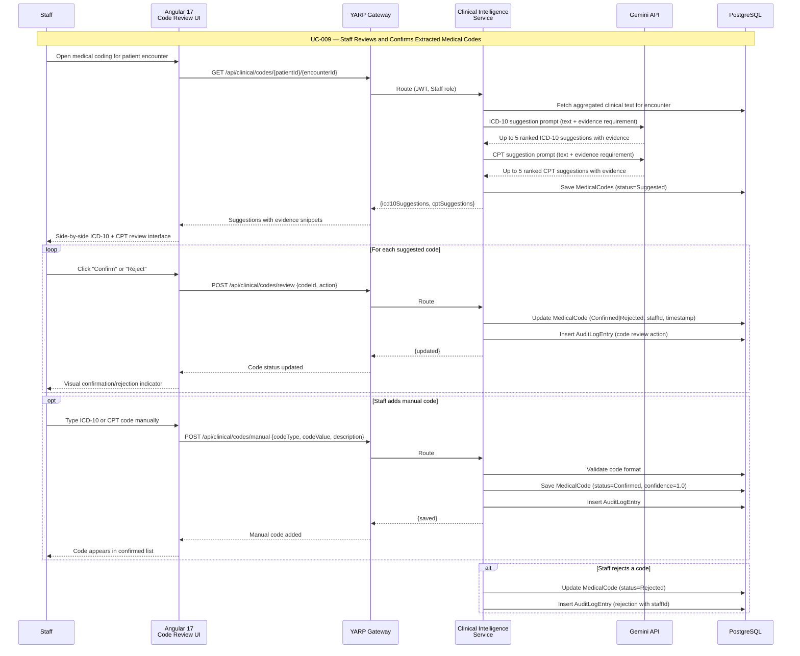
```mermaid
sequenceDiagram
    participant S as Staff
    participant UI as Angular 17<br/>Code Review UI
    participant GW as YARP Gateway
    participant CS as Clinical Intelligence<br/>Service
    participant GEMINI as Gemini API
    participant DB as PostgreSQL

    Note over S,DB: UC-009 — Staff Reviews and Confirms Extracted Medical Codes

    S->>UI: Open medical coding for patient encounter
    UI->>GW: GET /api/clinical/codes/{patientId}/{encounterId}
    GW->>CS: Route (JWT, Staff role)
    CS->>DB: Fetch aggregated clinical text for encounter
    CS->>GEMINI: ICD-10 suggestion prompt (text + evidence requirement)
    GEMINI-->>CS: Up to 5 ranked ICD-10 suggestions with evidence
    CS->>GEMINI: CPT suggestion prompt (text + evidence requirement)
    GEMINI-->>CS: Up to 5 ranked CPT suggestions with evidence
    CS->>DB: Save MedicalCodes (status=Suggested)
    CS-->>GW: {icd10Suggestions, cptSuggestions}
    GW-->>UI: Suggestions with evidence snippets
    UI-->>S: Side-by-side ICD-10 + CPT review interface

    loop For each suggested code
        S->>UI: Click "Confirm" or "Reject"
        UI->>GW: POST /api/clinical/codes/review {codeId, action}
        GW->>CS: Route
        CS->>DB: Update MedicalCode (Confirmed|Rejected, staffId, timestamp)
        CS->>DB: Insert AuditLogEntry (code review action)
        CS-->>GW: {updated}
        GW-->>UI: Code status updated
        UI-->>S: Visual confirmation/rejection indicator
    end

    opt Staff adds manual code
        S->>UI: Type ICD-10 or CPT code manually
        UI->>GW: POST /api/clinical/codes/manual {codeType, codeValue, description}
        GW->>CS: Route
        CS->>DB: Validate code format
        CS->>DB: Save MedicalCode (status=Confirmed, confidence=1.0)
        CS->>DB: Insert AuditLogEntry
        CS-->>GW: {saved}
        GW-->>UI: Manual code added
        UI-->>S: Code appears in confirmed list
    end

    alt Staff rejects a code
        CS->>DB: Update MedicalCode (status=Rejected)
        CS->>DB: Insert AuditLogEntry (rejection with staffId)
    end
```

---

### UC-010: Admin Manages User Accounts
**Source:** `spec.md#UC-010`

<!-- RENDER type="mermaid" src="./uml-models/seq-uc-010.png" -->

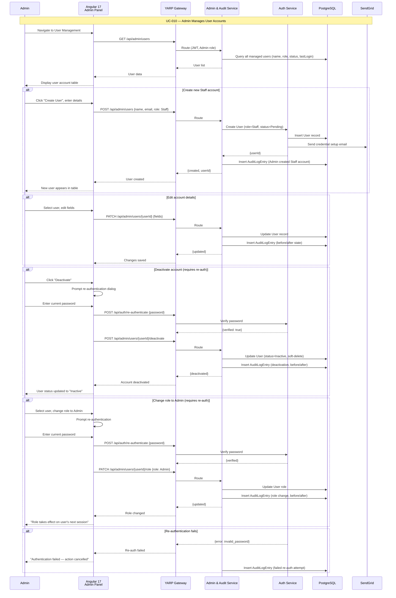
```mermaid
sequenceDiagram
    participant A as Admin
    participant UI as Angular 17<br/>Admin Panel
    participant GW as YARP Gateway
    participant ADMIN as Admin & Audit Service
    participant AUTH as Auth Service
    participant DB as PostgreSQL
    participant SG as SendGrid

    Note over A,SG: UC-010 — Admin Manages User Accounts

    A->>UI: Navigate to User Management
    UI->>GW: GET /api/admin/users
    GW->>ADMIN: Route (JWT, Admin role)
    ADMIN->>DB: Query all managed users (name, role, status, lastLogin)
    ADMIN-->>GW: User list
    GW-->>UI: User data
    UI-->>A: Display user account table

    alt Create new Staff account
        A->>UI: Click "Create User", enter details
        UI->>GW: POST /api/admin/users {name, email, role: Staff}
        GW->>ADMIN: Route
        ADMIN->>AUTH: Create User (role=Staff, status=Pending)
        AUTH->>DB: Insert User record
        AUTH->>SG: Send credential setup email
        AUTH-->>ADMIN: {userId}
        ADMIN->>DB: Insert AuditLogEntry (Admin created Staff account)
        ADMIN-->>GW: {created, userId}
        GW-->>UI: User created
        UI-->>A: New user appears in table
    end

    alt Edit account details
        A->>UI: Select user, edit fields
        UI->>GW: PATCH /api/admin/users/{userId} {fields}
        GW->>ADMIN: Route
        ADMIN->>DB: Update User record
        ADMIN->>DB: Insert AuditLogEntry (before/after state)
        ADMIN-->>GW: {updated}
        GW-->>UI: Changes saved
    end

    alt Deactivate account (requires re-auth)
        A->>UI: Click "Deactivate"
        UI->>UI: Prompt re-authentication dialog
        A->>UI: Enter current password
        UI->>GW: POST /api/auth/re-authenticate {password}
        GW->>AUTH: Verify password
        AUTH-->>GW: {verified: true}
        UI->>GW: POST /api/admin/users/{userId}/deactivate
        GW->>ADMIN: Route
        ADMIN->>DB: Update User (status=Inactive, soft-delete)
        ADMIN->>DB: Insert AuditLogEntry (deactivation, before/after)
        ADMIN-->>GW: {deactivated}
        GW-->>UI: Account deactivated
        UI-->>A: User status updated to "Inactive"
    end

    alt Change role to Admin (requires re-auth)
        A->>UI: Select user, change role to Admin
        UI->>UI: Prompt re-authentication
        A->>UI: Enter current password
        UI->>GW: POST /api/auth/re-authenticate {password}
        GW->>AUTH: Verify password
        AUTH-->>GW: {verified}
        UI->>GW: PATCH /api/admin/users/{userId}/role {role: Admin}
        GW->>ADMIN: Route
        ADMIN->>DB: Update User role
        ADMIN->>DB: Insert AuditLogEntry (role change, before/after)
        ADMIN-->>GW: {updated}
        GW-->>UI: Role changed
        UI-->>A: "Role takes effect on user's next session"
    end

    alt Re-authentication fails
        AUTH-->>GW: {error: invalid_password}
        GW-->>UI: Re-auth failed
        UI-->>A: "Authentication failed — action cancelled"
        ADMIN->>DB: Insert AuditLogEntry (failed re-auth attempt)
    end
```

---

### UC-011: System Sends Appointment Reminders
**Source:** `spec.md#UC-011`

<!-- RENDER type="mermaid" src="./uml-models/seq-uc-011.png" -->

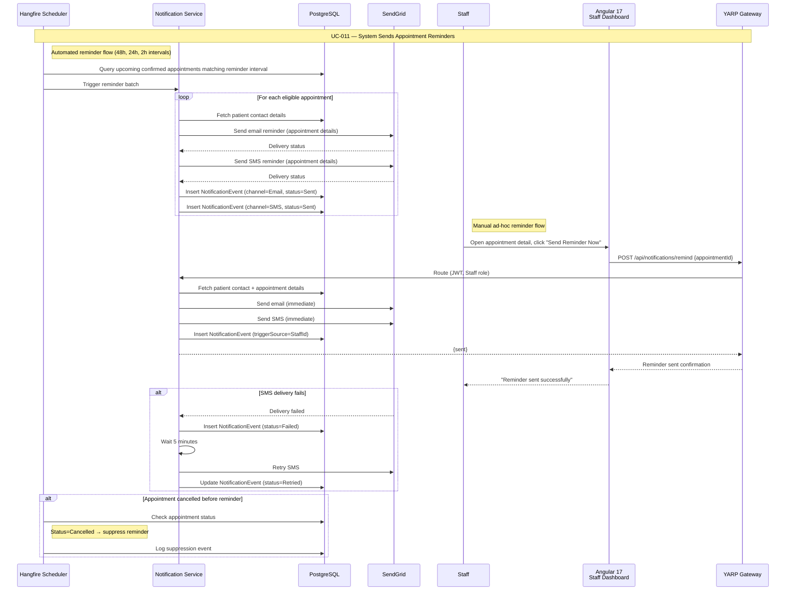
```mermaid
sequenceDiagram
    participant SCHED as Hangfire Scheduler
    participant NOTIF as Notification Service
    participant DB as PostgreSQL
    participant SG as SendGrid
    participant S as Staff
    participant UI as Angular 17<br/>Staff Dashboard
    participant GW as YARP Gateway

    Note over SCHED,GW: UC-011 — System Sends Appointment Reminders

    Note right of SCHED: Automated reminder flow (48h, 24h, 2h intervals)
    SCHED->>DB: Query upcoming confirmed appointments matching reminder interval
    SCHED->>NOTIF: Trigger reminder batch

    loop For each eligible appointment
        NOTIF->>DB: Fetch patient contact details
        NOTIF->>SG: Send email reminder (appointment details)
        SG-->>NOTIF: Delivery status
        NOTIF->>SG: Send SMS reminder (appointment details)
        SG-->>NOTIF: Delivery status
        NOTIF->>DB: Insert NotificationEvent (channel=Email, status=Sent)
        NOTIF->>DB: Insert NotificationEvent (channel=SMS, status=Sent)
    end

    Note right of S: Manual ad-hoc reminder flow
    S->>UI: Open appointment detail, click "Send Reminder Now"
    UI->>GW: POST /api/notifications/remind {appointmentId}
    GW->>NOTIF: Route (JWT, Staff role)
    NOTIF->>DB: Fetch patient contact + appointment details
    NOTIF->>SG: Send email (immediate)
    NOTIF->>SG: Send SMS (immediate)
    NOTIF->>DB: Insert NotificationEvent (triggerSource=StaffId)
    NOTIF-->>GW: {sent}
    GW-->>UI: Reminder sent confirmation
    UI-->>S: "Reminder sent successfully"

    alt SMS delivery fails
        SG-->>NOTIF: Delivery failed
        NOTIF->>DB: Insert NotificationEvent (status=Failed)
        NOTIF->>NOTIF: Wait 5 minutes
        NOTIF->>SG: Retry SMS
        NOTIF->>DB: Update NotificationEvent (status=Retried)
    end

    alt Appointment cancelled before reminder
        SCHED->>DB: Check appointment status
        Note right of SCHED: Status=Cancelled → suppress reminder
        SCHED->>DB: Log suppression event
    end
```

---

### UC-012: Patient Syncs Appointment to External Calendar
**Source:** `spec.md#UC-012`

<!-- RENDER type="mermaid" src="./uml-models/seq-uc-012.png" -->

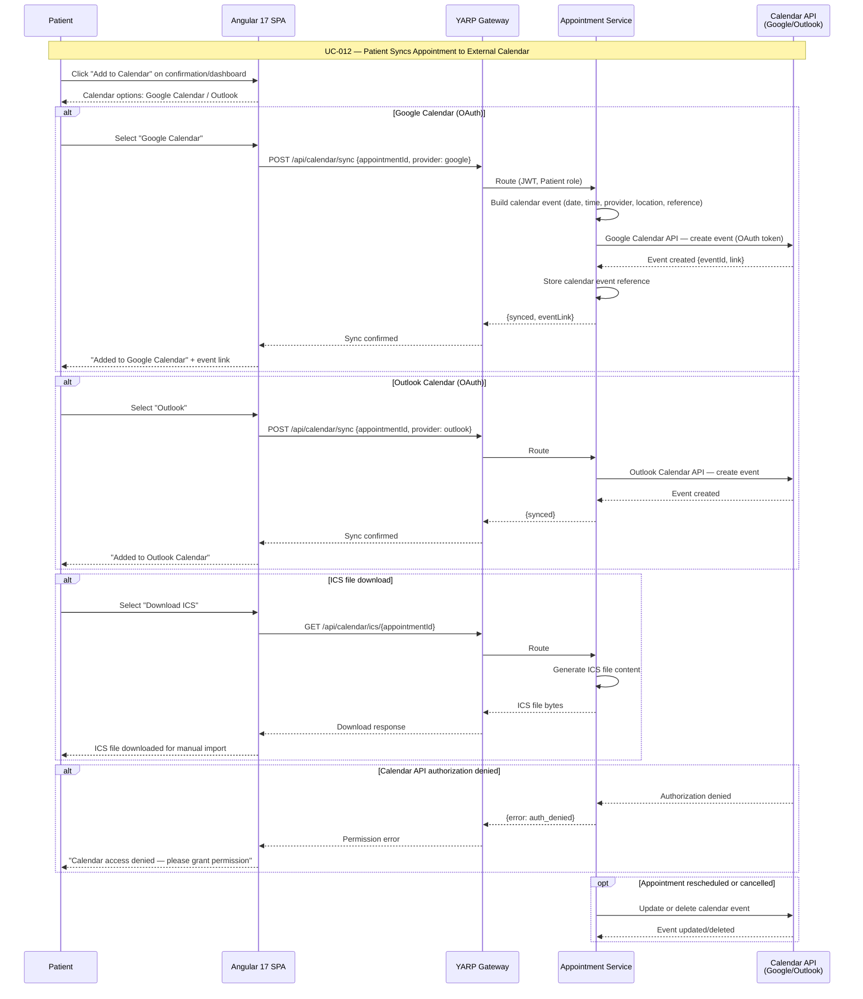
```mermaid
sequenceDiagram
    participant P as Patient
    participant UI as Angular 17 SPA
    participant GW as YARP Gateway
    participant APPT as Appointment Service
    participant CAL as Calendar API<br/>(Google/Outlook)

    Note over P,CAL: UC-012 — Patient Syncs Appointment to External Calendar

    P->>UI: Click "Add to Calendar" on confirmation/dashboard
    UI-->>P: Calendar options: Google Calendar / Outlook

    alt Google Calendar (OAuth)
        P->>UI: Select "Google Calendar"
        UI->>GW: POST /api/calendar/sync {appointmentId, provider: google}
        GW->>APPT: Route (JWT, Patient role)
        APPT->>APPT: Build calendar event (date, time, provider, location, reference)
        APPT->>CAL: Google Calendar API — create event (OAuth token)
        CAL-->>APPT: Event created {eventId, link}
        APPT->>APPT: Store calendar event reference
        APPT-->>GW: {synced, eventLink}
        GW-->>UI: Sync confirmed
        UI-->>P: "Added to Google Calendar" + event link
    end

    alt Outlook Calendar (OAuth)
        P->>UI: Select "Outlook"
        UI->>GW: POST /api/calendar/sync {appointmentId, provider: outlook}
        GW->>APPT: Route
        APPT->>CAL: Outlook Calendar API — create event
        CAL-->>APPT: Event created
        APPT-->>GW: {synced}
        GW-->>UI: Sync confirmed
        UI-->>P: "Added to Outlook Calendar"
    end

    alt ICS file download
        P->>UI: Select "Download ICS"
        UI->>GW: GET /api/calendar/ics/{appointmentId}
        GW->>APPT: Route
        APPT->>APPT: Generate ICS file content
        APPT-->>GW: ICS file bytes
        GW-->>UI: Download response
        UI-->>P: ICS file downloaded for manual import
    end

    alt Calendar API authorization denied
        CAL-->>APPT: Authorization denied
        APPT-->>GW: {error: auth_denied}
        GW-->>UI: Permission error
        UI-->>P: "Calendar access denied — please grant permission"
    end

    opt Appointment rescheduled or cancelled
        APPT->>CAL: Update or delete calendar event
        CAL-->>APPT: Event updated/deleted
    end
```
