# Requirements Specification

## Feature Goal

Build a unified, standalone healthcare platform — the **Unified Patient Access & Clinical Intelligence Platform** — that integrates a patient-centric appointment booking system with a "Trust-First" clinical intelligence engine. The platform must transition from the current fragmented state (disconnected scheduling tools and manual clinical data extraction) to an end-to-end, role-driven system where patients can self-schedule and complete digital intake, staff can manage walk-ins and same-day queues, and clinical data extracted from uploaded documents is automatically aggregated into a verified 360-Degree Patient View with mapped ICD-10 and CPT codes.

## Business Justification

- Providers experience up to 15% no-show rates due to complex booking processes and a lack of smart reminders; the platform reduces this through rule-based no-show risk scoring and automated multi-channel reminders.
- Clinical staff spend 20+ minutes manually extracting patient data from multi-format PDF reports; the platform reduces this to a 2-minute AI-assisted verification workflow, eliminating a primary bottleneck in clinical preparation.
- Existing solutions are fragmented — booking tools lack clinical data context, and current AI tools face a "Black Box" trust deficit requiring manual verification; this platform bridges both gaps with a transparent, source-traceable aggregation engine.
- The platform serves patients (self-service booking, digital intake), administrative staff (walk-in management, arrival marking, queue oversight), and admins (user lifecycle management), delivering measurable improvements across all three roles.
- A Dynamic Preferred Slot Swap feature reduces patient scheduling friction and maximizes slot utilization, directly impacting revenue recovery from unfilled cancellations.

## Feature Scope

The platform is scoped to Phase 1 and covers the following user-visible behaviors and technical capabilities:

**Patient-facing**: Self-registration, appointment booking with waitlist/preferred slot swap, AI-assisted or manual intake, insurance pre-check, clinical document upload, calendar sync, PDF confirmation via email, appointment reminders, and a patient dashboard.

**Staff-facing**: Walk-in booking (with optional account creation), same-day queue management, arrival marking, clinical data review and conflict resolution, medical code verification.

**Admin-facing**: User account lifecycle management (Staff and Admin roles), role assignment, audit log access.

**Clinical Intelligence**: Ingestion of uploaded PDFs, extraction of structured clinical data (vitals, medications, diagnoses, allergies), de-duplication, conflict detection, ICD-10/CPT code suggestion, and a 360-Degree Patient View.

**Out of Scope**: Provider logins or provider-facing actions, payment gateway integration, family member profiles, patient self-check-in (mobile, web portal, or QR code), direct bi-directional EHR integration, full claims submission, and paid cloud infrastructure (AWS, Azure).

### Success Criteria

- [ ] No-show rate demonstrably reduced from the 15% baseline after platform adoption, measurable via appointment completion rates.
- [ ] Clinical data retrieval time reduced from 20 minutes to 2 minutes, measured by time-to-complete the 360-degree view verification workflow.
- [ ] AI-Human Agreement Rate exceeds 98% for suggested ICD-10/CPT codes and extracted clinical data elements.
- [ ] Zero critical HIPAA compliance violations; all data handling, transmission, and storage passes a HIPAA compliance audit.
- [ ] Platform achieves 99.9% uptime measured over a rolling 30-day window.
- [ ] "Critical Conflicts Identified" metric is quantifiable and tracked per patient record.
- [ ] All patient appointments generate a PDF confirmation email within 60 seconds of booking.
- [ ] Session auto-timeout activates at exactly 15 minutes of inactivity across all roles.

## Functional Requirements

### FR Planning Summary

| Req-ID | Summary                                                   |
| ------ | --------------------------------------------------------- |
| FR-001 | RBAC enforcement with three roles: Patient, Staff, Admin  |
| FR-002 | Patient self-registration with email validation           |
| FR-003 | Staff creates patient account during walk-in              |
| FR-004 | Session auto-timeout after 15 minutes                     |
| FR-005 | Admin-only account management                             |
| FR-006 | Authentication event audit logging                        |
| FR-007 | Patient profile view and edit                             |
| FR-008 | Patient demographic data storage                          |
| FR-009 | Patient dashboard with appointments and upload status     |
| FR-010 | Patient self-edits intake without staff assistance        |
| FR-011 | Real-time available slot display                          |
| FR-012 | Single-workflow appointment booking                       |
| FR-013 | Double-booking prevention                                 |
| FR-014 | Appointment cancellation and rescheduling                 |
| FR-015 | PDF confirmation email on booking                         |
| FR-016 | AI-assisted conversational intake                         |
| FR-017 | Manual intake form fallback                               |
| FR-018 | Seamless switch between intake modes                      |
| FR-019 | Edit previously submitted intake data                     |
| FR-020 | Preferred slot designation on booking                     |
| FR-021 | Preferred slot availability monitoring                    |
| FR-022 | Automatic slot swap on preferred slot opening             |
| FR-023 | Patient notification on slot swap execution               |
| FR-024 | Staff-exclusive walk-in booking                           |
| FR-025 | Optional account creation during walk-in                  |
| FR-026 | Same-day queue view for staff                             |
| FR-027 | Staff-only "Arrived" marking                              |
| FR-028 | No-show risk score calculation                            |
| FR-029 | Risk score display on staff interface                     |
| FR-030 | High-risk appointment flagging                            |
| FR-031 | Multi-channel automated reminders (SMS + Email)           |
| FR-032 | Configurable reminder intervals                           |
| FR-033 | Manual ad-hoc reminder trigger by staff                   |
| FR-034 | Reminder delivery event logging                           |
| FR-035 | Google Calendar and Outlook sync via free APIs            |
| FR-036 | Calendar event with full appointment details              |
| FR-037 | Calendar event update/removal on change                   |
| FR-038 | Soft insurance pre-check against dummy records            |
| FR-039 | Insurance validation status display                       |
| FR-040 | Booking proceeds regardless of insurance status           |
| FR-041 | Patient uploads historical clinical documents (PDF)       |
| FR-042 | Batch document upload in single session                   |
| FR-043 | Encrypted document storage at rest                        |
| FR-044 | Staff uploads post-visit clinical notes                   |
| FR-045 | AI extraction of structured clinical data from documents  |
| FR-046 | Data aggregation into de-duplicated patient view          |
| FR-047 | Staff verification of aggregated 360-degree view          |
| FR-048 | Reduce clinical retrieval to 2-minute verification        |
| FR-049 | Source traceability for each data element                 |
| FR-050 | AI extraction of ICD-10 codes from clinical data          |
| FR-051 | AI extraction of CPT codes from clinical data             |
| FR-052 | Staff review and confirmation of suggested codes          |
| FR-053 | Confirmed code storage linked to patient/encounter        |
| FR-054 | AI detection of conflicting data across documents         |
| FR-055 | Explicit conflict highlighting with source identification |
| FR-056 | Mandatory conflict resolution before profile completion   |
| FR-057 | Immutable audit log of all patient data access            |
| FR-058 | Clinical data modification event logging                  |
| FR-059 | Audit log restricted to Admin read-only access            |
| FR-060 | Admin CRUD on Staff and Admin accounts                    |
| FR-061 | Admin role and permission assignment                      |
| FR-062 | Admin re-authentication before user management            |

---

### Domain A: Authentication & Authorization

- **FR-001**: [DETERMINISTIC] System MUST enforce role-based access control (RBAC) with three mutually exclusive roles — Patient, Staff, and Admin — where each role has a distinct set of permitted actions and no role may perform actions outside its defined permission set.
- **FR-002**: [DETERMINISTIC] System MUST allow unauthenticated users to self-register as a Patient by providing a valid email address, a password meeting minimum complexity rules (minimum 8 characters, at least one uppercase, one digit, one special character), and basic demographic information, with email address verified before account activation.
- **FR-003**: [DETERMINISTIC] System MUST allow Staff members to create a Patient account on behalf of a walk-in patient during the walk-in booking flow, with the option to skip account creation and proceed as a guest visit.
- **FR-004**: [DETERMINISTIC] System MUST automatically terminate authenticated sessions for all roles after exactly 15 consecutive minutes of user inactivity, requiring re-authentication to resume.
- **FR-005**: [DETERMINISTIC] System MUST restrict creation, modification, activation, and deactivation of Staff and Admin user accounts exclusively to authenticated Admin-role users.
- **FR-006**: [DETERMINISTIC] System MUST record all authentication events — including successful logins, logouts, failed login attempts, and session timeouts — to an immutable audit log with a UTC timestamp, user identifier, role, and originating IP address.

### Domain B: Patient Profile Management

- **FR-007**: [DETERMINISTIC] System MUST allow authenticated Patient-role users to view their own profile and edit non-locked fields (contact information, emergency contact, communication preferences) without staff assistance.
- **FR-008**: [DETERMINISTIC] System MUST store and maintain structured patient demographic data including legal name, date of birth, biological sex, primary contact number, email address, address, and insurance details (insurer name, member ID, group number).
- **FR-009**: [DETERMINISTIC] System MUST provide authenticated patients with a personalized dashboard displaying: upcoming appointments with status, pending intake form items, document upload history, and 360-degree view availability indicator.
- **FR-010**: [DETERMINISTIC] System MUST allow patients to review and update previously submitted intake information at any time through a self-service edit flow without requiring staff intervention or generating a new intake record.

### Domain C: Appointment Booking — Patient Self-Service

- **FR-011**: [DETERMINISTIC] System MUST display currently available appointment slots to authenticated patients in real time, with slot availability reflecting confirmed and pending bookings without delay.
- **FR-012**: [DETERMINISTIC] System MUST allow authenticated patients to complete an appointment booking in a single end-to-end workflow that collects: slot selection, intake mode selection, insurance pre-check initiation, and confirmation — without requiring multiple separate sessions.
- **FR-013**: [DETERMINISTIC] System MUST prevent concurrent booking of the same appointment slot by two or more users by applying optimistic locking or an equivalent concurrency-safe reservation mechanism.
- **FR-014**: [DETERMINISTIC] System MUST allow authenticated patients to cancel or reschedule an existing upcoming appointment via self-service, releasing the original slot immediately upon cancellation.
- **FR-015**: [DETERMINISTIC] System MUST generate a branded PDF document containing appointment date, time, location/modality, provider name, and reference number, and email it to the patient's registered email address within 60 seconds of booking confirmation.

### Domain D: Intake Management

- **FR-016**: [AI-CANDIDATE] System MUST offer an AI-assisted conversational intake experience that dynamically guides the patient through health history questions via a chat interface, interprets free-text responses using natural language understanding, and automatically populates structured intake form fields from parsed answers.
- **FR-017**: [DETERMINISTIC] System MUST provide a traditional manual intake form containing all required clinical and demographic fields as a fully functional alternative to the AI-assisted intake, accessible at any time during or after the booking flow.
- **FR-018**: [DETERMINISTIC] System MUST allow patients to switch between AI-assisted conversational intake and the manual form at any point during intake completion, preserving all data already entered in either mode without data loss.
- **FR-019**: [DETERMINISTIC] System MUST allow patients to return to and edit any previously submitted intake response — including after the initial intake has been saved — without requiring staff assistance or creating a duplicate record.

### Domain E: Dynamic Preferred Slot Swap

- **FR-020**: [DETERMINISTIC] System MUST allow a patient, at the time of booking an available slot, to simultaneously designate one currently unavailable slot as their "preferred slot," recording the preferred slot in a waitlist queue linked to the patient's appointment.
- **FR-021**: [DETERMINISTIC] System MUST continuously monitor the availability status of all waitlisted preferred slots and detect when a preferred slot transitions from unavailable to available due to a cancellation or rescheduling event.
- **FR-022**: [DETERMINISTIC] System MUST automatically execute a slot swap when a patient's preferred slot becomes available — cancelling the patient's current booking, assigning the patient to the preferred slot, and releasing the original slot back to the general availability pool — within 60 seconds of the preferred slot opening.
- **FR-023**: [DETERMINISTIC] System MUST notify the patient via both email and SMS immediately after a slot swap is executed, including the new appointment date, time, and a reference number, with delivery confirmed and logged.

### Domain F: Walk-In & Same-Day Queue Management

- **FR-024**: [DETERMINISTIC] System MUST restrict the creation of walk-in appointments exclusively to authenticated Staff-role users; Patient-role users must have no access to walk-in booking controls.
- **FR-025**: [DETERMINISTIC] System MUST provide Staff users with an optional flow during walk-in booking to create a basic Patient account (name, contact, email) linked to the walk-in appointment, with the ability to skip account creation for anonymous visit tracking.
- **FR-026**: [DETERMINISTIC] System MUST provide Staff users with a same-day queue view displaying all appointments scheduled for the current calendar day, including patient name, appointment time, booking type (self-booked/walk-in), and current arrival status.
- **FR-027**: [DETERMINISTIC] System MUST restrict the "Arrived" status marking for any appointment exclusively to authenticated Staff-role users; no patient-facing interface (web, mobile, or QR code) must expose a self-check-in mechanism.

### Domain G: No-Show Risk Assessment

- **FR-028**: [AI-CANDIDATE] System MUST calculate a no-show risk score (Low / Medium / High) for each upcoming appointment by analyzing patient behavioral indicators including prior no-show history, booking lead time, appointment type, intake completion status, and reminder response patterns.
- **FR-029**: [DETERMINISTIC] System MUST display the calculated no-show risk score alongside each appointment entry in the Staff appointment management interface, with color-coded severity indicators (green/amber/red).
- **FR-030**: [HYBRID] System MUST automatically flag appointments assessed as High-risk and present Staff users with a set of recommended intervention actions (e.g., additional reminder, call-back request), which the Staff member must explicitly accept or dismiss.

### Domain H: Multi-Channel Reminders

- **FR-031**: [DETERMINISTIC] System MUST send automated appointment reminders to patients via both email and SMS channels for every confirmed upcoming appointment.
- **FR-032**: [DETERMINISTIC] System MUST send reminders at the following default intervals before the appointment time: 48 hours, 24 hours, and 2 hours, with the intervals configurable by Staff or Admin from the system settings interface.
- **FR-033**: [DETERMINISTIC] System MUST allow Staff users to manually trigger an ad-hoc reminder for any specific patient appointment from the appointment detail view, independent of the automated schedule.
- **FR-034**: [DETERMINISTIC] System MUST log every reminder delivery event — including channel, timestamp, delivery status (sent/failed), and triggering user (system or staff ID) — to the audit trail.

### Domain I: Calendar Sync

- **FR-035**: [DETERMINISTIC] System MUST support appointment export as calendar events to Google Calendar and Microsoft Outlook using free, open-source-compatible API standards (iCalendar/ICS format or OAuth-based calendar API integrations available under free tiers).
- **FR-036**: [DETERMINISTIC] System MUST populate exported calendar events with the following minimum fields: appointment date, start and end time, provider name, clinic/location name, appointment type, and booking reference number.
- **FR-037**: [DETERMINISTIC] System MUST update the corresponding calendar event when an appointment is rescheduled and remove the calendar event when an appointment is cancelled, propagating changes to the patient's connected calendar service.

### Domain J: Insurance Pre-Check

- **FR-038**: [DETERMINISTIC] System MUST perform a soft insurance pre-check during the booking flow by matching the patient-provided insurance name and member ID against a predefined internal set of dummy insurer records maintained by the system.
- **FR-039**: [DETERMINISTIC] System MUST display a clear insurance validation status to the patient after pre-check: "Verified" (match found), "Not Recognized" (no match), or "Incomplete" (missing fields), with guidance text for each outcome.
- **FR-040**: [DETERMINISTIC] System MUST allow the appointment booking workflow to proceed to confirmation regardless of the insurance pre-check outcome, treating the pre-check as informational rather than a blocking gate.

### Domain K: Clinical Document Upload

- **FR-041**: [DETERMINISTIC] System MUST allow authenticated Patient-role users to upload historical clinical documents in PDF format through a dedicated document upload interface accessible from their patient dashboard.
- **FR-042**: [DETERMINISTIC] System MUST support uploading multiple PDF documents in a single upload session, with a maximum file size of 25 MB per document and a maximum of 20 documents per upload batch.
- **FR-043**: [DETERMINISTIC] System MUST encrypt all uploaded clinical documents at rest using AES-256 encryption and in transit using TLS 1.2 or higher, in compliance with HIPAA Security Rule requirements.
- **FR-044**: [DETERMINISTIC] System MUST allow authenticated Staff-role users to upload post-visit clinical notes in PDF format on behalf of a patient, attaching the document to the patient's record with a visit encounter reference.

### Domain L: 360-Degree Patient View (Clinical Data Aggregation)

- **FR-045**: [AI-CANDIDATE] System MUST process each uploaded patient PDF document using an AI extraction pipeline to identify and extract structured clinical data elements including vitals (blood pressure, heart rate, weight, height), current and historical medications with dosages, diagnoses with dates, allergies, immunization history, and surgical history.
- **FR-046**: [AI-CANDIDATE] System MUST aggregate extracted clinical data elements from all uploaded documents for a patient into a single, de-duplicated patient profile view, eliminating duplicate entries for the same data element while preserving all unique values.
- **FR-047**: [HYBRID] System MUST present the aggregated 360-degree patient view to authenticated Staff-role users in a structured review interface, requiring explicit staff verification before the view is marked as "Verified" and made available for clinical use.
- **FR-048**: [AI-CANDIDATE] System MUST reduce the clinical data retrieval workflow to a maximum of 2 minutes for a staff member to review and verify the aggregated 360-degree view for a patient with up to 10 uploaded documents, measured from page load to verification action.
- **FR-049**: [DETERMINISTIC] System MUST maintain a source traceability record for every extracted data element in the 360-degree view, linking each element to its originating document name, page number (where applicable), and upload timestamp.

### Domain M: Medical Code Extraction

- **FR-050**: [AI-CANDIDATE] System MUST analyze the aggregated patient clinical data to identify and suggest applicable ICD-10 diagnostic codes, mapping each suggested code to the specific diagnosis or clinical finding that supports it.
- **FR-051**: [AI-CANDIDATE] System MUST analyze the aggregated patient clinical data to identify and suggest applicable CPT procedure codes, mapping each suggested code to the clinical procedure or service documented in the patient record.
- **FR-052**: [HYBRID] System MUST present all suggested ICD-10 and CPT codes to authenticated Staff-role users in a side-by-side review interface (code, description, supporting evidence), requiring explicit staff confirmation or rejection for each code before codes are saved.
- **FR-053**: [DETERMINISTIC] System MUST store staff-confirmed ICD-10 and CPT codes linked to the patient's unique identifier and the specific visit encounter, with confirmation timestamp and confirming staff member ID recorded.

### Domain N: Data Conflict Detection & Resolution

- **FR-054**: [AI-CANDIDATE] System MUST detect conflicting data elements across two or more uploaded documents for the same patient — specifically including conflicting medication names, dosages, allergy entries, and diagnosis dates — and classify each conflict by severity (Critical / Warning).
- **FR-055**: [DETERMINISTIC] System MUST explicitly highlight all detected conflicts within the 360-degree patient view using a visually distinct conflict indicator, displaying the conflicting values side by side with the source document identified for each value.
- **FR-056**: [HYBRID] System MUST require an authenticated Staff-role user to explicitly resolve or acknowledge each identified data conflict — by selecting the authoritative value or marking the conflict as reviewed — before the patient's 360-degree profile can be marked as "Complete."

### Domain O: Audit Logging

- **FR-057**: [DETERMINISTIC] System MUST maintain an immutable, append-only audit log capturing every patient data access event, including the accessing user's ID and role, the patient record accessed, the action performed (view/create/update/delete), and a UTC timestamp.
- **FR-058**: [DETERMINISTIC] System MUST log all clinical data modification events — including document uploads, intake edits, code confirmations, conflict resolutions, and 360-degree view verifications — with full before-and-after state capture where applicable.
- **FR-059**: [DETERMINISTIC] System MUST restrict audit log access exclusively to authenticated Admin-role users in a read-only interface; no modification, deletion, or export of audit records must be possible from within the application.

### Domain P: Admin User Management

- **FR-060**: [DETERMINISTIC] System MUST allow authenticated Admin-role users to create new Staff and Admin accounts, view all managed user accounts with their status and role, edit account details, and deactivate (soft-delete) accounts without permanently deleting records.
- **FR-061**: [DETERMINISTIC] System MUST allow Admin-role users to assign a role (Staff or Admin) to any managed user account and modify the role assignment at any time, with the change taking effect on the user's next session.
- **FR-062**: [DETERMINISTIC] System MUST require Admin-role users to re-authenticate (confirm current password) before any destructive user management action — including deactivation of an account or role elevation to Admin — is committed to the system.

## Use Case Analysis

### Actors & System Boundary

- **Patient**: A registered (or optionally anonymous) individual who books appointments, completes intake, uploads documents, and views their dashboard. Interacts with the system via a web browser (Angular 17 frontend).
- **Staff (Front Desk / Call Center)**: An authenticated healthcare operations employee who manages walk-in bookings, the same-day queue, arrival marking, and clinical data verification. Interacts via a staff dashboard.
- **Admin**: A privileged system operator who manages user accounts and role assignments and reviews audit logs.
- **Notification Service (System Actor)**: An automated system component responsible for sending SMS and email reminders and slot-swap notifications.
- **Clinical Intelligence Engine (System Actor)**: An AI-powered backend service that processes uploaded PDFs to extract structured clinical data, detect conflicts, and suggest medical codes.
- **Calendar Service (System Actor)**: An external free-tier API (Google Calendar, Outlook) that receives calendar event create/update/delete requests from the system.
- **Insurance Validation Service (System Actor)**: An internal rule-based component that matches patient insurance data against predefined dummy records.

---

### Use Case Specifications

#### UC-001: Patient Self-Registers and Books an Appointment

- **Actor(s)**: Patient
- **Goal**: Register a new account and book an available appointment slot, optionally designating a preferred slot.
- **Preconditions**: The patient does not have an existing account; at least one appointment slot is available in the system.
- **Success Scenario**:
  1. Patient navigates to the registration page and provides email, password, and demographic details.
  2. System validates email uniqueness and password complexity; sends a verification email.
  3. Patient confirms email and is redirected to the booking interface.
  4. System displays available appointment slots in real time.
  5. Patient selects an available slot and optionally designates an unavailable slot as preferred.
  6. System initiates the insurance pre-check flow (soft validation).
  7. Patient provides insurance name and member ID; system returns a validation status.
  8. Patient selects intake mode (AI-assisted or manual) and begins intake.
  9. System confirms the booking, generates a PDF confirmation, and emails it to the patient within 60 seconds.
  10. System adds the appointment to the patient's dashboard and offers a calendar sync option.
- **Extensions/Alternatives**:
  - 2a. Email already registered → System displays an error; patient is redirected to login.
  - 7a. Insurance not recognized → System displays "Not Recognized" status; booking proceeds.
  - 5a. Patient chooses not to designate a preferred slot → System skips waitlist registration.
  - 9a. PDF generation fails → System queues the PDF for retry and notifies the patient when sent.
- **Postconditions**: Patient account is active, appointment is confirmed, PDF confirmation is sent, preferred slot waitlist entry exists (if applicable), intake is in progress.

##### Use Case Diagram

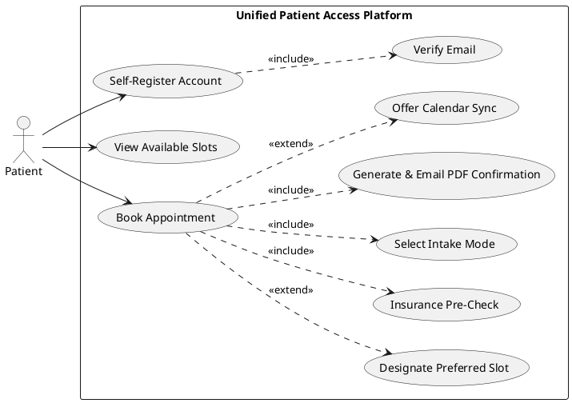

---

#### UC-002: Patient Completes AI-Assisted Conversational Intake

- **Actor(s)**: Patient, Clinical Intelligence Engine
- **Goal**: Complete the appointment intake form through a guided AI chat interface that auto-populates structured fields.
- **Preconditions**: Patient has a confirmed appointment booking; intake has not been completed.
- **Success Scenario**:
  1. Patient opens the intake interface and selects "AI-Assisted" mode.
  2. Clinical Intelligence Engine initiates the conversational flow with an opening question.
  3. Patient types free-text responses to each question.
  4. System parses each response using NLU and maps extracted values to structured intake fields (medications, allergies, conditions, etc.).
  5. System displays a live preview of the auto-populated form alongside the chat.
  6. Patient reviews the auto-populated fields and confirms or corrects individual values.
  7. Patient submits the completed intake; system saves the structured intake record.
- **Extensions/Alternatives**:
  - 3a. Patient switches to manual form mid-intake → System preserves all already-parsed field values and opens the manual form pre-populated.
  - 4a. NLU confidence is below threshold for a field → System explicitly asks a clarifying follow-up question for that field.
  - 7a. Patient exits without submitting → System autosaves progress; patient can resume on next login.
- **Postconditions**: Intake record is saved in structured format linked to the appointment; intake completion status on dashboard is updated.

##### Use Case Diagram

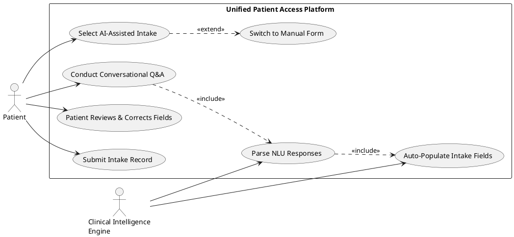

---

#### UC-003: Patient Completes Manual Intake Form

- **Actor(s)**: Patient
- **Goal**: Complete the intake form using a traditional structured form without AI assistance.
- **Preconditions**: Patient has a confirmed appointment booking; intake is incomplete.
- **Success Scenario**:
  1. Patient opens the intake interface and selects "Manual Form" mode.
  2. System renders the structured intake form with all required and optional fields.
  3. Patient fills in demographic and clinical fields (medical history, medications, allergies, conditions).
  4. Patient saves a draft at any time; system autosaves on field blur.
  5. Patient submits the completed form; system validates required fields and saves the intake record.
- **Extensions/Alternatives**:
  - 1a. Patient was in AI intake and switches to manual → Form is pre-populated with previously parsed values.
  - 5a. Required fields are missing → System highlights missing fields; submission is blocked until resolved.
- **Postconditions**: Intake record is saved, linked to the appointment, and marked complete on the patient dashboard.

##### Use Case Diagram

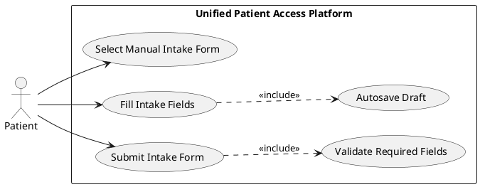

---

#### UC-004: Preferred Slot Swap Triggered Automatically

- **Actor(s)**: Notification Service (System Actor), Patient (notified)
- **Goal**: Automatically move a patient to their preferred appointment slot when it becomes available.
- **Preconditions**: A patient has a confirmed booking and an active preferred slot waitlist entry; the preferred slot is currently unavailable.
- **Success Scenario**:
  1. Another patient cancels or reschedules an appointment, releasing the slot.
  2. System detects that the released slot matches a waitlisted preferred slot entry.
  3. System executes the slot swap within 60 seconds: cancels the patient's current booking and assigns them to the preferred slot.
  4. System releases the patient's original slot to the general availability pool.
  5. Notification Service sends an email and SMS to the patient with the new appointment details.
  6. System updates the patient's dashboard to reflect the new appointment.
- **Extensions/Alternatives**:
  - 2a. Multiple patients have the same preferred slot waitlisted → System applies first-in-first-out (FIFO) ordering; remaining patients retain their waitlist entries.
  - 5a. SMS delivery fails → System logs the failure and retries once; email delivery is treated as confirmation fallback.
- **Postconditions**: Patient is confirmed in the preferred slot; original slot is available; patient is notified; audit log records the swap event.

##### Use Case Diagram

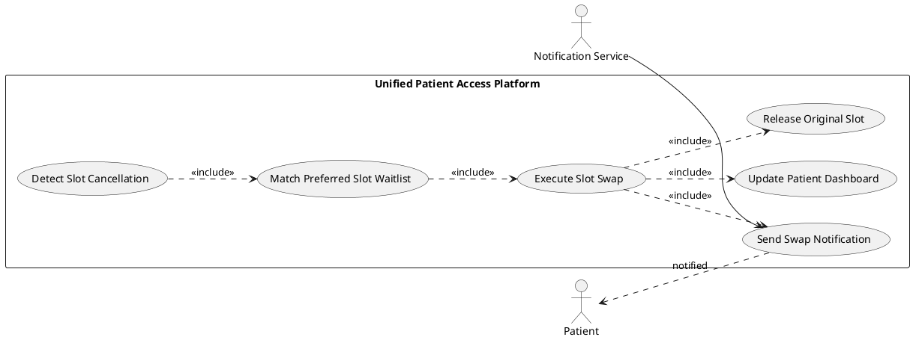

---

#### UC-005: Staff Creates a Walk-In Booking

- **Actor(s)**: Staff
- **Goal**: Register an unscheduled patient visit and optionally create a patient account.
- **Preconditions**: Staff is authenticated; at least one appointment slot is available for the current day (or walk-in is added to queue without a specific slot).
- **Success Scenario**:
  1. Staff navigates to the walk-in booking interface.
  2. Staff searches for an existing patient by name or date of birth.
  3. If found, staff selects the patient and proceeds to slot selection.
  4. If not found, staff optionally creates a basic patient profile (name, contact, email).
  5. Staff assigns the walk-in to an available slot or adds them to the same-day queue.
  6. System confirms the walk-in booking and adds the patient to the same-day queue view.
- **Extensions/Alternatives**:
  - 4a. Staff skips account creation → Walk-in is tracked as anonymous; system generates a temporary visit ID.
  - 5a. No slots available → Staff adds the patient to a walk-in overflow queue with a wait-time estimate.
- **Postconditions**: Walk-in booking is recorded, patient appears in the same-day queue view with status "Pending Arrival."

##### Use Case Diagram

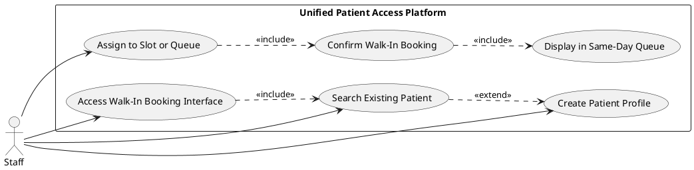

---

#### UC-006: Staff Marks Patient as Arrived

- **Actor(s)**: Staff
- **Goal**: Record that a patient has physically arrived for their appointment, updating the queue view.
- **Preconditions**: Staff is authenticated; appointment exists in today's same-day queue with status "Pending Arrival."
- **Success Scenario**:
  1. Staff opens the same-day queue view.
  2. Staff locates the patient's appointment entry.
  3. Staff clicks "Mark as Arrived."
  4. System updates the appointment status to "Arrived" with a timestamp.
  5. Queue view reflects the updated status in real time.
- **Extensions/Alternatives**:
  - 3a. Patient appointment is not in today's queue → Staff searches by patient name or reference number; system retrieves the record.
- **Postconditions**: Appointment status is "Arrived" with an arrival timestamp recorded; audit log captures the staff ID and action timestamp.

##### Use Case Diagram

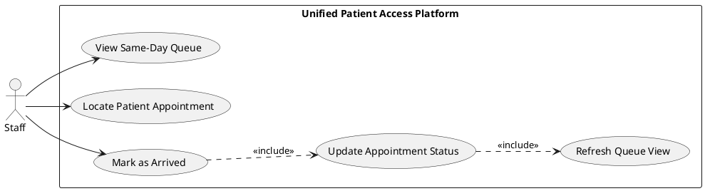

---

#### UC-007: Patient Uploads Clinical Documents

- **Actor(s)**: Patient
- **Goal**: Upload one or more historical clinical PDF documents for AI-based extraction and profile enrichment.
- **Preconditions**: Patient is authenticated and has an active patient dashboard.
- **Success Scenario**:
  1. Patient navigates to the document upload section of the dashboard.
  2. Patient selects one or more PDF files (up to 20 files, 25 MB each).
  3. System validates file type (PDF only) and file size for each document.
  4. System encrypts and stores each document at rest using AES-256.
  5. System queues each document for processing by the Clinical Intelligence Engine.
  6. Dashboard updates the document upload history with upload status per file.
- **Extensions/Alternatives**:
  - 3a. File exceeds 25 MB → System rejects that file and notifies the patient with an error message; other valid files proceed.
  - 3b. Non-PDF file selected → System rejects the file and displays a supported format message.
  - 5a. Intelligence Engine processing is delayed → Dashboard shows "Processing" status; patient is notified by email when extraction is complete.
- **Postconditions**: Documents are securely stored, processing is queued, upload history is updated, audit log records the upload event.

##### Use Case Diagram

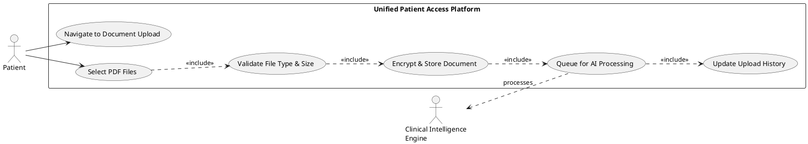

---

#### UC-008: System Generates 360-Degree Patient View

- **Actor(s)**: Clinical Intelligence Engine (System Actor), Staff
- **Goal**: Process all uploaded patient documents to produce a unified, de-duplicated, verified patient clinical profile.
- **Preconditions**: At least one clinical document has been uploaded and queued for processing; Staff member opens the patient's 360-degree view.
- **Success Scenario**:
  1. Clinical Intelligence Engine extracts structured data from each uploaded PDF (vitals, medications, diagnoses, allergies, surgical/immunization history).
  2. System aggregates extracted data from all documents, de-duplicating identical entries.
  3. System detects conflicting values across documents and flags them with severity classification.
  4. System presents the aggregated 360-degree view to the Staff member in a structured review interface.
  5. Staff reviews extracted data, resolves flagged conflicts by selecting authoritative values, and verifies the profile.
  6. System marks the 360-degree profile as "Verified" and makes it available for clinical use.
- **Extensions/Alternatives**:
  - 1a. Document is unreadable or corrupted → System marks that document as "Extraction Failed" and excludes it, notifying staff.
  - 3a. No conflicts detected → System displays the unified view without conflict indicators; staff proceeds directly to verification.
- **Postconditions**: 360-degree patient profile is "Verified," source traceability records exist for all data elements, conflicts are resolved, audit log captures verification event.

##### Use Case Diagram

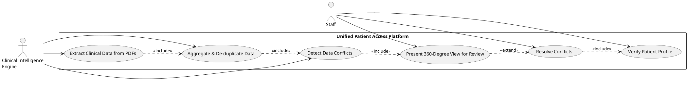

---

#### UC-009: Staff Reviews and Confirms Extracted Medical Codes

- **Actor(s)**: Staff, Clinical Intelligence Engine
- **Goal**: Review AI-suggested ICD-10 and CPT codes and confirm or reject each code for the patient's encounter record.
- **Preconditions**: 360-degree patient view is "Verified"; Clinical Intelligence Engine has generated suggested codes.
- **Success Scenario**:
  1. Staff opens the medical coding review interface for a patient encounter.
  2. System displays a list of AI-suggested ICD-10 codes with supporting clinical evidence for each.
  3. System displays a list of AI-suggested CPT codes with supporting procedure evidence for each.
  4. Staff reviews each suggested code and selects "Confirm" or "Reject" for each.
  5. Staff may manually add a code not suggested by the AI.
  6. Staff submits the confirmed code set; system saves codes linked to the patient record and encounter.
- **Extensions/Alternatives**:
  - 4a. Staff rejects a code → System removes it from the confirmed set and logs the rejection with staff ID.
  - 5a. Staff adds a manual code → System validates the code format against the ICD-10/CPT standard code library before saving.
- **Postconditions**: Confirmed ICD-10 and CPT codes are saved, linked to the encounter, with staff confirmation timestamp recorded.

##### Use Case Diagram

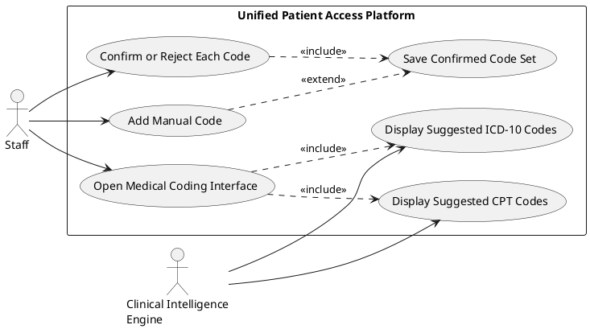

---

#### UC-010: Admin Manages User Accounts

- **Actor(s)**: Admin
- **Goal**: Create, view, edit, deactivate, and assign roles to Staff and Admin user accounts.
- **Preconditions**: Admin is authenticated.
- **Success Scenario**:
  1. Admin navigates to the User Management interface.
  2. System displays a list of all managed user accounts with name, role, status, and last login.
  3. Admin selects an action: Create, Edit, Deactivate, or Change Role.
  4. For deactivation or role elevation to Admin, system prompts Admin to re-authenticate (confirm password).
  5. Admin confirms the re-authentication and the action is executed.
  6. System applies the change; affected user's next session reflects the new state.
- **Extensions/Alternatives**:
  - 4a. Re-authentication fails → System rejects the action and logs the failed attempt.
  - 3a. Admin creates a new Staff account → System sends a credential setup email to the new user.
- **Postconditions**: User account changes are persisted; audit log records the Admin action with before/after state.

##### Use Case Diagram

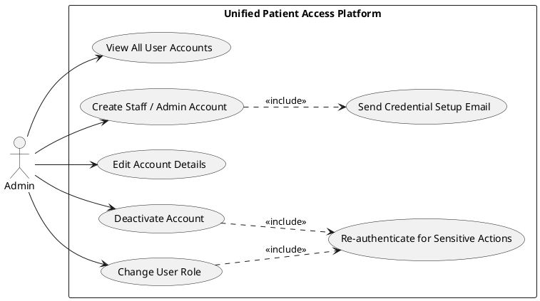

---

#### UC-011: System Sends Appointment Reminders

- **Actor(s)**: Notification Service (System Actor), Staff (manual trigger)
- **Goal**: Deliver automated and manual appointment reminders to patients via email and SMS.
- **Preconditions**: Appointment is in "Confirmed" status; patient has a registered email and phone number.
- **Success Scenario**:
  1. System scheduler evaluates upcoming appointments at each configured reminder interval (48h, 24h, 2h).
  2. For each eligible appointment, Notification Service sends an email and SMS reminder with appointment details.
  3. System logs each delivery event (channel, status, timestamp) to the audit trail.
  4. (Manual flow) Staff accesses appointment detail and clicks "Send Reminder Now."
  5. Notification Service dispatches an ad-hoc email and SMS immediately.
  6. System logs the manual trigger event with the staff member's ID.
- **Extensions/Alternatives**:
  - 2a. SMS delivery fails → System logs the failure and retries once after 5 minutes; email is treated as delivery confirmation.
  - 2b. Appointment is cancelled before a scheduled reminder fires → System suppresses the reminder and logs the suppression event.
- **Postconditions**: Reminder delivery events are logged; patient has received notification(s) per configured schedule.

##### Use Case Diagram

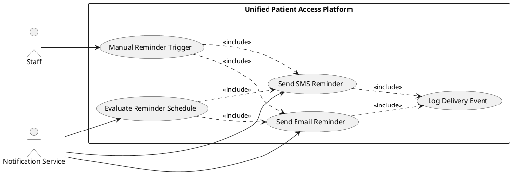

---

#### UC-012: Patient Syncs Appointment to External Calendar

- **Actor(s)**: Patient, Calendar Service (System Actor)
- **Goal**: Export a confirmed appointment to the patient's Google Calendar or Outlook calendar.
- **Preconditions**: Patient has a confirmed appointment; patient initiates calendar sync from the dashboard or confirmation page.
- **Success Scenario**:
  1. Patient clicks "Add to Calendar" on the appointment confirmation page or dashboard.
  2. System presents calendar options: "Google Calendar" and "Outlook."
  3. Patient selects preferred calendar service.
  4. System generates a calendar event with appointment details and initiates the appropriate API call or provides an ICS download.
  5. Calendar Service creates the event in the patient's selected calendar.
  6. System confirms successful sync and displays the event link to the patient.
- **Extensions/Alternatives**:
  - 4a. Patient selects ICS download → System generates and serves the ICS file for manual import.
  - 5a. Calendar API authorization is denied by patient → System displays a permission guidance message; no event is created.
  - Reschedule/Cancel: System updates or deletes the calendar event via the same API when the appointment changes.
- **Postconditions**: Calendar event exists in the patient's chosen calendar service with correct appointment details.

##### Use Case Diagram

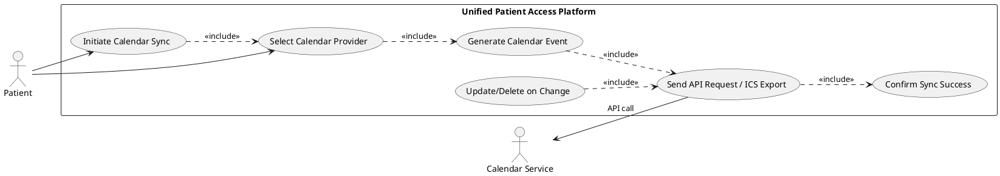

## Risks & Mitigations

1. **AI Accuracy Below 98% Threshold (Critical)**: The ICD-10/CPT code suggestion and clinical data extraction accuracy may fall below the 98% AI-Human Agreement Rate target due to variability in PDF document quality, handwriting, or non-standard clinical terminology. _Mitigation_: Implement a mandatory human-in-the-loop verification step (FR-047, FR-052) for all AI-generated outputs; log and track AI-Human disagreement rates as a KPI to trigger model retraining cycles.

2. **HIPAA Compliance Violation Risk (Critical)**: Improper handling of PHI (Protected Health Information) — including insufficient encryption, inadequate access controls, or missing audit logs — could result in regulatory penalties. _Mitigation_: Enforce AES-256 at rest and TLS 1.2+ in transit (FR-043), maintain immutable audit logs (FR-057, FR-058), enforce RBAC on all PHI access (FR-001), and conduct a HIPAA security assessment prior to production launch.

3. **Slot Swap Race Condition (High)**: Concurrent preferred slot monitoring by multiple waitlisted patients for the same preferred slot may result in a race condition where the same slot is assigned to more than one patient. _Mitigation_: Implement distributed locking or a database-level optimistic concurrency mechanism on slot assignment (FR-013, FR-022); apply FIFO ordering for waitlist resolution (UC-004 Extension 2a).

4. **Document Format Variability Degrading Extraction (Medium)**: Uploaded PDF documents may be scanned images, password-protected, or in non-standard layouts, causing AI extraction pipeline failures. _Mitigation_: Implement pre-processing validation to detect corrupted or image-only PDFs and mark them as "Extraction Failed" with a staff notification (UC-008 Extension 1a); define supported document specifications in the patient-facing upload guidance.

5. **Free-Tier Platform Reliability Constraints (Medium)**: Hosting on free-tier platforms (Netlify, Vercel, GitHub Codespaces) introduces cold-start latency, rate limits, and availability constraints that may impact the 99.9% uptime NFR. _Mitigation_: Architect the backend as stateless microservices (FR design consideration) to maximize cold-start recovery speed; use Upstash Redis for low-latency session and cache operations; implement graceful degradation for non-critical features.

## Constraints & Assumptions

1. **No Paid Cloud Infrastructure**: The platform must be hosted exclusively on free, open-source-friendly platforms (Netlify, Vercel, GitHub Codespaces). AWS, Azure, GCP, and equivalent paid cloud services are strictly out of scope for Phase 1. All auxiliary tools and services must be free and open-source.

2. **Technology Stack is Fixed**: The frontend is Angular 17 with Standalone Components and RxJS; the backend is .NET 8 ASP.NET Core Web API with a microservices architecture, Entity Framework Core, and PostgreSQL. Deviations from this stack require explicit change approval and are out of scope.

3. **Insurance Validation is Soft and Dummy-Record-Based**: The insurance pre-check validates against a predefined, internally maintained set of dummy records only (FR-038). No real-time integration with actual insurance payer systems is in scope for Phase 1; results are informational and non-blocking.

4. **Clinical AI is Not a Regulated Medical Device**: The AI clinical data extraction and medical code suggestion features are decision-support tools only. All AI-generated outputs are subject to mandatory human staff verification (FR-047, FR-052, FR-056) and must never be applied to patient records without explicit staff confirmation. The platform does not certify or warrant clinical accuracy of AI outputs.

5. **No Provider-Facing Functionality**: Provider logins, provider scheduling configuration, provider-patient messaging, and any provider-driven clinical actions are explicitly out of scope. All clinical data verification and medical code confirmation actions are performed by Staff-role users, not clinical providers.
